#  Лабораторная работа №2. Запросы DCL. Резервное копирование. 

> **Цель работы:** Получить теоретические и практические навыки импорта и экспорта данных в PostgreSQL, создания пользователей, включения их в группы и назначения им прав, а также создания полной версии бекапа и части данных. 

## Средства выполнения 

* СУБД PostgreSQL 
* Средство администрирования pgAdmin

## Пункты задания для выполнения 

1. Изучить теоретические сведения лабораторной работы. 
2. Выполнить импорт данных из csv-файла в БД (2-мя способами - с помощью sql-команды и с помощью графического интерфейса pgAdmin).  
3. Выполнить экспорт данных из БД в csv-файл (2-мя способами - с помощью sql-команды и с помощью графического интерфейса pgAdmin).   
4. Создать нового пользователя БД.
5. Назначить ему права на чтение таблицы через группу.
6. Отозвать права на чтение таблицы.
7. Назначить пользователю все привелегии на таблицу напрямую. 
8. Сменить пользователю пароль (с помощью команды ALTER).
9. Выполнить бэкап БД и восстановление с помощью утилит pg_dump и psql. 
10. Выполнить бэкап БД и восстановление с помощью pgAdmin. 
11. Защитить лабораторную работу.


## Теоретическая часть
### Импорт данных из .csv-файла

Предполагается, что у вас уже есть необходимый .csv-файл, и первое, что нужно сделать, это перейти pgAdmin и создать там новую базу данных. Ну или воспользоваться уже существующей, в зависимости от текущих нужд. В данном случае была создана БД test_db.

В выбранной БД создается таблица с полями, типы которых должны соответствовать «колонкам» в выбранном .csv-файле.


Вводим команду на импорт данных из файла:
```sql
COPY person FROM '/home/people.csv' DELIMITER ',' CSV HEADER;
```
> *Примечание:* если БД развернута в docker контейнере, то перед выполнением команды COPY необходимо скопировать файл csv в контейнер с помощью команды: <docker cp /home/student/people.csv postgres:/home/>

Проверяем, что данные были загружены:

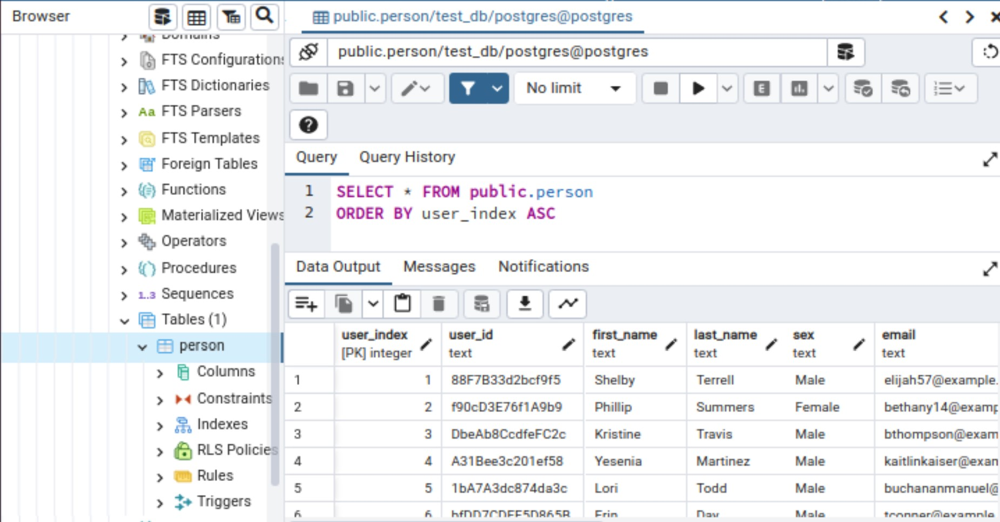

### Экспорт данных в .csv-файл

Предположим, нам надо сохранить таблицу person в csv файл.

Для этого выполним команду:
```sql
COPY person TO '/home/people_1.csv' DELIMITER ',' CSV HEADER;
```

Существует и другой способ экспорта через pgAdmin: правой кнопкой мыши по нужной таблице – экспорт – указание параметров экспорта в открывшемся окне.

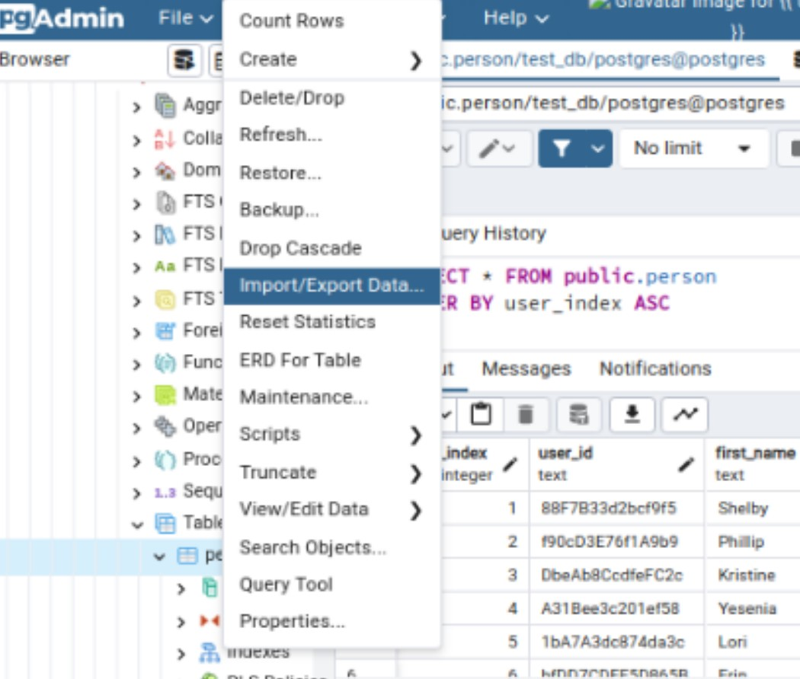

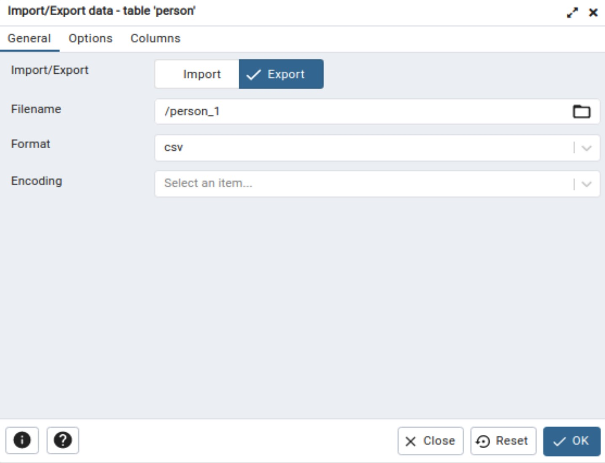

### Запросы DCL 

**Data Control Language (DCL)** – группа операторов определения доступа к данным. Иными словами, это операторы для управления разрешениями, с помощью них мы можем разрешать или запрещать выполнение определенных операций над объектами базы данных.

Сюда входят:

* GRANT – предоставляет пользователю или группе разрешения на определённые операции с объектом;
* REVOKE – отзывает выданные разрешения.


### Создание пользователя PostgreSQL

 В современных версиях этой СУБД нет понятий «пользователь» или «группа», они объединены в одну сущность — «роль». И хотя в Postgres есть отдельные команды для создания пользователя или роли, на самом деле они создают одну и ту же сущность. Роль может иметь возможность входа в систему (то есть подключаться к БД и выполнять запросы) или не иметь ее.

Для удобства во многих ​​руководствах и инструментах роль с возможностью входа называется «пользователь», а роль без этой возможности — «группа» или «групповая роль». В этой статье мы тоже будем придерживаться этих наименований.

Итак, существует несколько способов создания пользователя в командной строке:
1. **CREATE ROLE** — SQL-команда, которая выполняется на сервере базы данных. По умолчанию создается роль с параметром NOLOGIN, который означает, что эта роль не может залогиниться в СУБД. Но если указать явно параметр LOGIN, тогда эта команда будет эквивалентна созданию пользователя.

Синтаксис:
```
CREATE ROLE <название> [
```

Пример использования:
CREATE ROLE selectel_user LOGIN PASSWORD ‘bestpass’; — создать пользователя и установить ему пароль.

2. **CREATE USER** — тоже SQL-команда, которая выполняется на сервере. Это алиас к предыдущей команде CREATE ROLE. Единственно отличие в том, что эта команда по умолчанию использует параметр LOGIN, который разрешает логиниться в базу данных.

Синтаксис и пример использования аналогичны команде CREATE ROLE.

### Создание пользователя PostgreSQL в графическом интерфейсе

С помощью pgAdmin подключимся к базе данных и в разделе Login/Group Roles вызовем контекстное меню и выберем Create — Login/Group Role.


Появится диалоговое окно с несколькими вкладками. На первой вкладке укажем имя пользователя, при желании можно указать его описание в поле Comments:

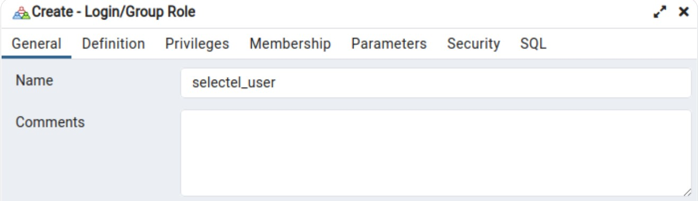

На вкладке Definition зададим пароль. Тут же можно указать дату истечения, после которого пользователю обязательно нужно будет сменить пароль:

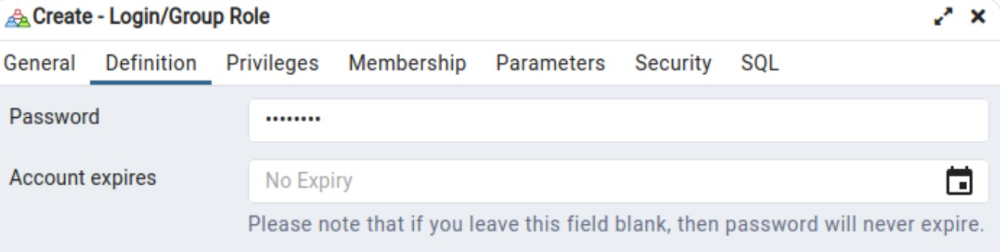

На вкладке Privileges можно указать, какими полномочиями будет обладать пользователь: логиниться, создавать другие роли или базы данных, будет ли это суперпользователь и т.п. Мы выберем лишь опцию Login, остальное оставим по умолчанию:

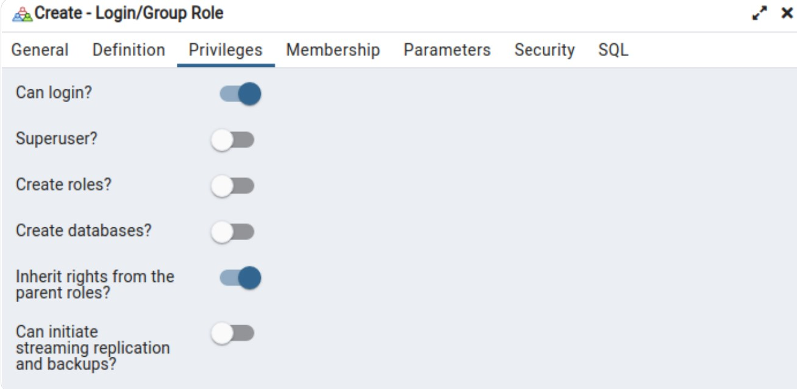

На вкладке Membership можно присвоить пользователю роли. Для примера мы присвоим ему встроенную в Postgres роль pg_monitor, которая дает права на просмотр различных таблиц и представлений, связанных с мониторингом и диагностикой базы данных:

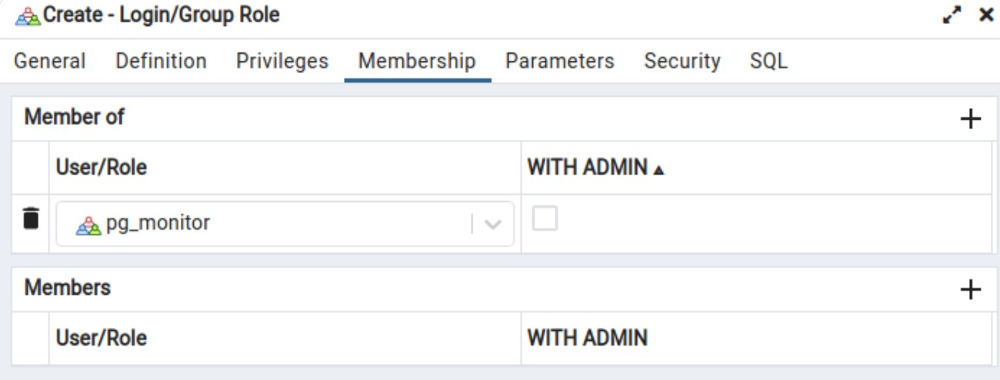

На последней вкладке SQL можно увидеть SQL-команды, с помощью которых будет создан пользователь. Запоминать и копировать их не обязательно, pgAdmin выполнит их за нас. Эта вкладка нужна скорее для финальной проверки.

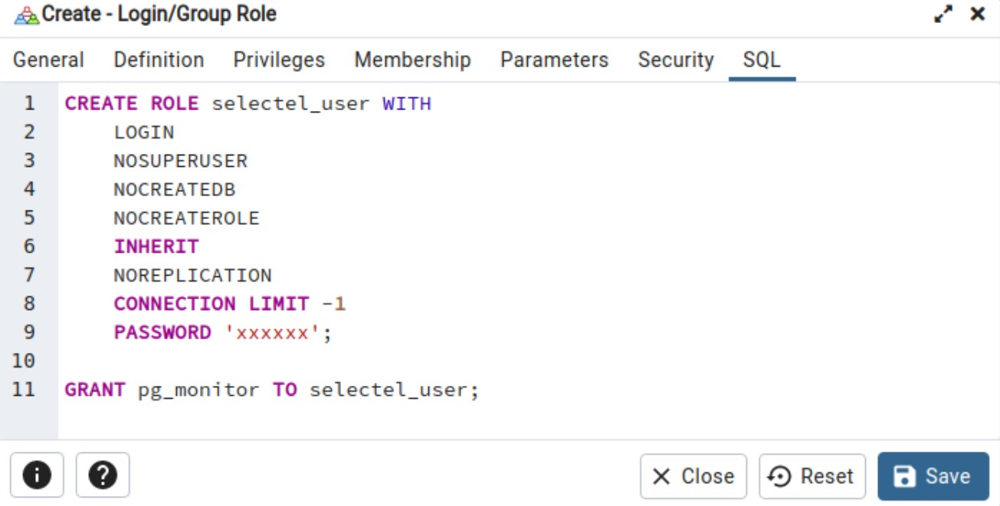

Нажимаем на кнопку Save, и пользователь создается. Мы можем увидеть его в разделе Login/Group Roles:

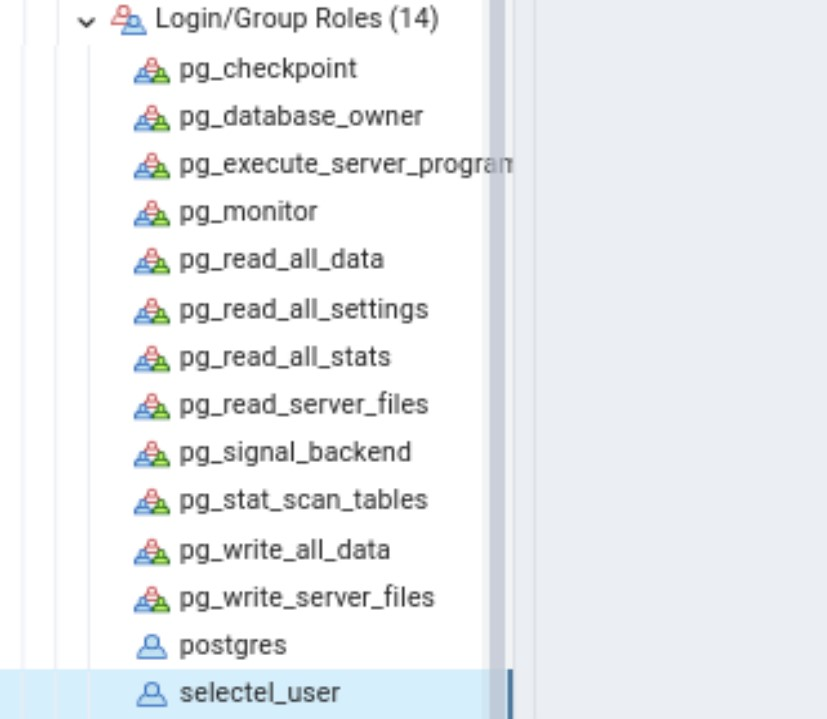


### Добавление и удаление прав с помощью групп

В Postgres роли могут наследоваться от других ролей. А так как роль — это либо «пользователь», либо «группа», получается, что пользователи могут наследовать привилегии от групп или других пользователей. Мы рассмотрим настройку с наследованием от групп. Создадим две группы: одну с правами только на чтение данных из таблицы, а другую — с правами на чтение и запись. По очереди назначим пользователю эти группы и посмотрим на результат.

Создаем группы:

```sql
CREATE ROLE "read_only_role";
CREATE ROLE "read_write_role";
```

Мы создали группы, но не дали им никаких привилегий. В нашей БД есть таблица person, на которой мы будем проверять работу назначения привилегий. Группе read_only_role дадим права на чтение этой таблицы, а группе read_write_role — на чтение и запись:
sql
```
GRANT SELECT ON TABLE person TO read_only_role;
GRANT SELECT, INSERT, UPDATE, DELETE on TABLE person TO read_write_role;
```

Группы созданы, но наш пользователь еще не унаследовал их привилегии. Для начала убедимся, что у него нет прав на чтение данных из таблицы. Залогинимся в БД под пользователем selectel_user и выполним команду:

```sql
SELECT * FROM person;
```

Получим ошибку: 

```
ERROR:  permission denied for table person
```

Теперь из под учетной записи владельца присвоим пользователю роль на чтение:

```sql
GRANT read_only_role TO selectel_user;
```

Снова попробуем выполнить запрос от имени пользователя и увидим результат:

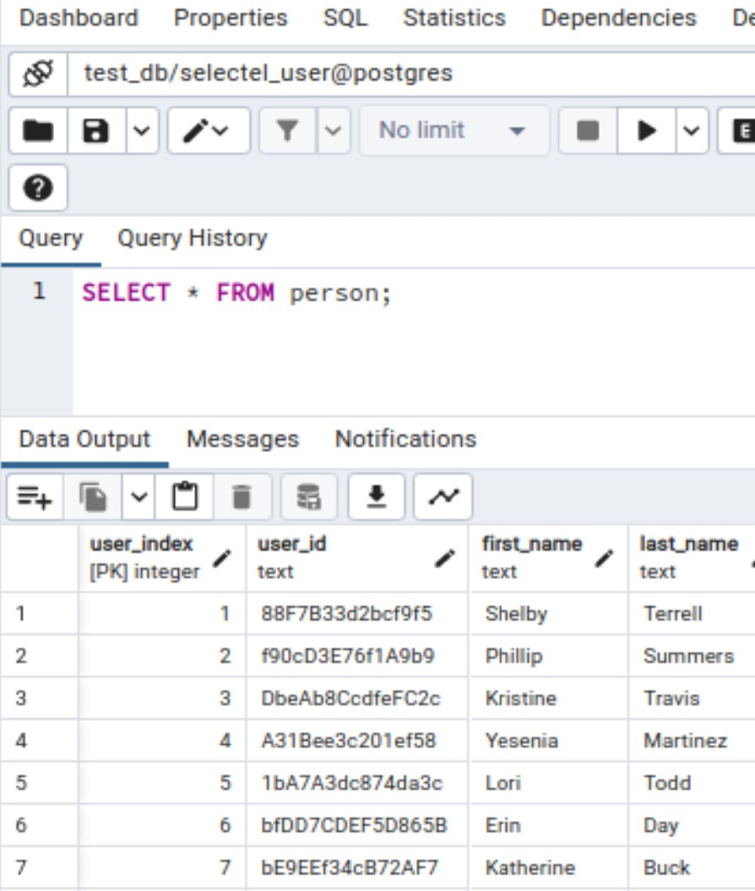


Теперь попробуем вставить строку в таблицу:

```sql
INSERT INTO person VALUES (101, 'fj48h39ru399', 'Anna', 'Ivanova', 'Female', 'test@mail.ru', '89007250000', '2000-01-01 00:00:00', 'Student');
```

Получим ошибку:

```
ERROR:  permission denied for table person
```

Все работает,  как мы планировали: у пользователя есть права на чтение данных из таблицы, но нет прав на вставку данных (а также изменение и удаление, но мы не будем это проверять).

Теперь заберем у пользователя группу на чтение и присвоим группу с правами на чтение и запись:

```sql
REVOKE read_only_role FROM selectel_user;
GRANT read_write_role TO selectel_user;
```

Снова попробуем вставить строку и убедимся, что данные появились в таблице. Результат выполнения команды:
```
INSERT 0 1
```

### Изменение пользователя: добавление привилегий напрямую и смена пароля

Добавим пользователю привилегии на таблицу person напрямую. Это делается аналогично назначению привилегий на группу, только вместо группы укажем имя пользователя. В этот раз вместо указания конкретных привилегий мы воспользуемся конструкцией ALL PRIVILEGES, которая сразу дает все полномочия на таблицу:

```sql
GRANT ALL PRIVILEGES ON TABLE person TO selectel_user;
```
Итак, мы назначили пользователю привилегии на таблицу напрямую, минуя роли.

Также покажем, как можно обновить пароль пользователю. Для этого достаточно выполнить одну простую команду:

```sql
ALTER USER selectel_user PASSWORD 'newpass';
```

### Создание резервной копии с помощью pg_dump

Для создания бэкапа БД на Postgres воспользуемся утилитой pg_dump. Она позволяет сделать резервную копию таблицы, базы, схемы или данных.

Идея, стоящая за этим методом, заключается в генерации текстового файла с командами SQL, которые при выполнении на сервере пересоздадут базу данных в том же самом состоянии, в котором она была на момент выгрузки. Подробнее можно ознакомиться [тут](https://postgrespro.ru/docs/postgresql/9.6/backup-dump).

Перейдём в целевой каталог, в котором планируется сохранить файл бэкапа и выполним команду:

```
pg_dump имя_базы -h хост -p порт -U пользователь > имя_файла_бэкапа.sql
```

Разумеется, подключиться можно как к локальной базе, так и к базе, расположенной на сервере. После того, как файл создался, можем приступить к созданию копии.

Для начала создайте базу (её имя может быть любым), а также пользователя, имя которого должно совпадать с именем пользователя, который работает с исходной базой. Скорее всего, это имя, которое вы использовали для параметра -U в команде, указанной выше. Но точнее лучше посмотреть в полученном файле бэкапа. В скрипте создания таблиц можно увидеть строчку вида:

```
ALTER TABLE имя_базы OWNER TO имя_пользователя;
```

Здесь именно то имя, которое должно быть в новой базе. И в качестве owner для новой базы тоже лучше указать его.

Затем выполняем команду:
```
psql имя_новой_базы < имя_файла_бэкапа.sql имя_пользователя
```

Такой короткий вариант команды возможен, если копию мы разворачиваем на локальной машине. Если же требуется развернуть на удалённой базе, то нужно будет также указать хост, порт и имя пользователя аналогично тому, как мы это делали при создании бэкапа.

### Создание резервной копии с помощью pgAdmin

Резервное копирование также можно выполнить через графический интерфейс pgAdmin.

Заходим в pgAdmin, находим нужную базу данных, нажимаем правой кнопкой мыши на нее и выбираем Backup. В появившимся окне нажимаем на троеточие (выбор папки). Выбираем нужную папку, далее (когда уже определились с папкой) вводим название будущего файла без расширения. На скриншоте test – это не папка, а как раз название будущего файла. Запускаем Backup.

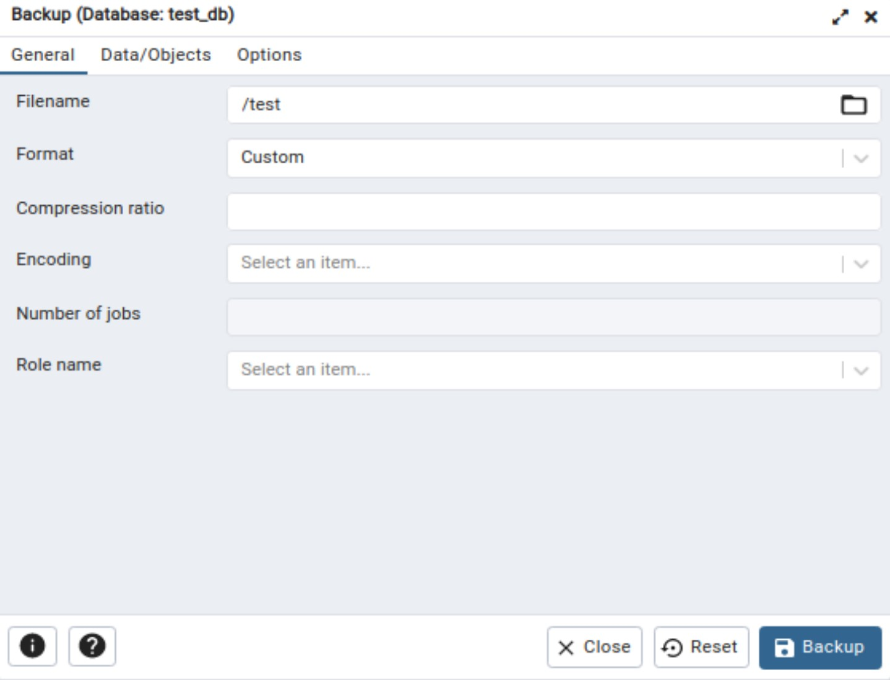

Если все прошло успешно, то в выбраном месте у вас появится файл с копией базы данных.

Для восстановления из резервной копии создаем новую БД. После выбираете созданную новую базу данных и кликаете правой кнопкой мыши по ней. В контекстном меню выбираете Restore. После нажимаете на троеточие и выбираете файл с бекапом. Нажмите Restore:


Все, база данных восстановлена из резервной копии.

### Контрольные вопросы  

1. Какой командой выполняется импорт csv-файла? Опишите структуру.
2. Что такое DCL? Какие операторы туда вхолдят?
3. В чем заключается отличие пользователя от роли в PostgreSQL? 
4. Перечислите способы создания пользователя.
5. Опишите структуру команды GRANT. 
6. Опишите структуру команды REVOKE.
7. С помощью какой команды можно сменить пароль пользователя?
8. Перечислите способы создания резервной копии.
9. Что является результатом выполнения программы pg_dump?
10. Какой командой выполняется восстановление БД из резервной копии?