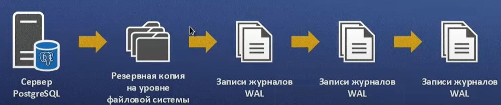

#  Лабораторная работа №2. Запросы DCL. Резервное копирование. 

> **Цель работы:** Получить теоретические и практические навыки импорта и экспорта данных в PostgreSQL, создания пользователей, включения их в группы и назначения им прав, а также создания полной версии бекапа и части данных. 

## Средства выполнения 

* СУБД PostgreSQL 
* Средство администрирования pgAdmin

## Пункты задания для выполнения 

1. Изучить теоретические сведения лабораторной работы. 
2. Выполнить импорт данных из csv-файла в БД (2-мя способами - с помощью sql-команды и с помощью графического интерфейса pgAdmin).  
3. Выполнить экспорт данных из БД в csv-файл (2-мя способами - с помощью sql-команды и с помощью графического интерфейса pgAdmin).   
4. Выполнить бэкап БД и восстановление методом выгрузки в SQL. 
5. Выполнить бэкап БД и восстановление на уровне файловой системы. 
6. Настроить непрерывное архивирование БД. 
7. Защитить лабораторную работу.


## Теоретическая часть
### Импорт данных из .csv-файла

Предполагается, что у вас уже есть необходимый .csv-файл, и первое, что нужно сделать, это перейти pgAdmin и создать там новую базу данных. Ну или воспользоваться уже существующей, в зависимости от текущих нужд. В данном случае была создана БД test_db.

В выбранной БД создается таблица с полями, типы которых должны соответствовать «колонкам» в выбранном .csv-файле.


Вводим команду на импорт данных из файла:
```sql
COPY person FROM '/home/people.csv' DELIMITER ',' CSV HEADER;
```
> *Примечание:* если БД развернута в docker контейнере, то перед выполнением команды COPY необходимо скопировать файл csv в контейнер с помощью команды: <docker cp /home/student/people.csv postgres:/home/>

Проверяем, что данные были загружены:


### Экспорт данных в .csv-файл

Предположим, нам надо сохранить таблицу person в csv файл.

Для этого выполним команду:
```sql
COPY person TO '/home/people_1.csv' DELIMITER ',' CSV HEADER;
```

Существует и другой способ экспорта через pgAdmin: правой кнопкой мыши по нужной таблице – экспорт – указание параметров экспорта в открывшемся окне.


### Резервное копирование

Как и всё, что содержит важные данные, базы данных PostgreSQL следует регулярно сохранять в резервной копии. Существует три фундаментально разных подхода к резервному копированию данных в PostgreSQL:

* Выгрузка в SQL
* Копирование на уровне файлов
* Непрерывное архивирование

### Выгрузка в SQL

Идея, стоящая за этим методом, заключается в генерации текстового файла с командами SQL, которые при выполнении на сервере пересоздадут базу данных в том же самом состоянии, в котором она была на момент выгрузки. Подробнее можно ознакомиться [тут](https://postgrespro.ru/docs/postgresql/9.6/backup-dump).

Существует 2 способа создания бекапа на основе выгрузки в SQL:

1. **Создание резервной копии с помощью pg_dump**

Для создания бэкапа БД на Postgres воспользуемся утилитой pg_dump. Она позволяет сделать резервную копию таблицы, базы, схемы или данных.

Перейдём в целевой каталог, в котором планируется сохранить файл бэкапа и выполним команду:

```
pg_dump имя_базы -h хост -p порт -U пользователь > имя_файла_бэкапа.sql
```

Разумеется, подключиться можно как к локальной базе, так и к базе, расположенной на сервере. После того, как файл создался, можем приступить к созданию копии.

Для начала создайте базу (её имя может быть любым), а также пользователя, имя которого должно совпадать с именем пользователя, который работает с исходной базой. Скорее всего, это имя, которое вы использовали для параметра -U в команде, указанной выше. Но точнее лучше посмотреть в полученном файле бэкапа. В скрипте создания таблиц можно увидеть строчку вида:

```sql
ALTER TABLE имя_базы OWNER TO имя_пользователя;
```

Здесь именно то имя, которое должно быть в новой базе. И в качестве owner для новой базы тоже лучше указать его.

Затем выполняем команду:
```
psql имя_новой_базы < имя_файла_бэкапа.sql имя_пользователя
```

Такой короткий вариант команды возможен, если копию мы разворачиваем на локальной машине. Если же требуется развернуть на удалённой базе, то нужно будет также указать хост, порт и имя пользователя аналогично тому, как мы это делали при создании бэкапа.

2. **Создание резервной копии с помощью pgAdmin**

Резервное копирование также можно выполнить через графический интерфейс pgAdmin.

Заходим в pgAdmin, находим нужную базу данных, нажимаем правой кнопкой мыши на нее и выбираем Backup. В появившимся окне нажимаем на троеточие (выбор папки). Выбираем нужную папку, далее (когда уже определились с папкой) вводим название будущего файла без расширения. На скриншоте test – это не папка, а как раз название будущего файла. Запускаем Backup.


Если все прошло успешно, то в выбраном месте у вас появится файл с копией базы данных.

Для восстановления из резервной копии создаем новую БД. После выбираете созданную новую базу данных и кликаете правой кнопкой мыши по ней. В контекстном меню выбираете Restore. После нажимаете на троеточие и выбираете файл с бекапом. Нажмите Restore:


Все, база данных восстановлена из резервной копии.

### Копирование на уровне файлов

Альтернативной стратегией резервного копирования является непосредственное [копирование файлов](https://postgrespro.ru/docs/postgresql/9.6/backup-file), в которых PostgreSQL хранит содержимое базы данных. 

*Прим.* В ОС Linux файлы обычно размещаются в */usr/local/pgsql/data* или в */var/lib/postgresql/12/main/*.

Процедура копирования:
1. Остановка службы postgresql.
```console
service postgresql stop
```

2. Создание резеревной копии файлов.
```console
tar -cf backup.tar /var/lib/postgresql/12/main
```

3. Запуск службы postgresql.
```console
service postgresql start
```

Процедура восстановления:

1. Остановка службы postgresql.
```console
service postgresql stop
```

2. Удаление данных в каталоге кластера.
```console
rm -rf /var/lib/postgresql/12/main/*
```

3. Воостановление резервной копии файловой системы.
```console
tar -xf root/backup.tar  
sudo chown -R /var/lib/postgresql/12/main/
```

4. Запуск службы postgresql.
```console
service postgresql start
```

Преимущества:
* Резервное копирование на уровне файловой системы быстрее дампа SQL.

Недостатки:
* Резервная копия привязывается к текущей системе.
* Требуется остановка сервера БД.
* Частичное резервное копирование и восстановление недоступно.


### Непрерывное архивирование

PostgreSQL записывает каждое изменение данных в журнал предзаписи (WAL), который расположен в подкаталоге pg_xlog/ каталога с данными кластера баз данных. 
Непрерывная архивация состоит из резервного копирования на уровне файловой системы и файлов журнала (WAL).

Принцип работы:



Подробнее:
* [Документация PostgreSQL](https://postgrespro.ru/docs/postgresql/9.6/continuous-archiving)
* [Веб-каст](https://www.youtube.com/watch?v=DPSI5HbmcQY)

Настройка архивации:

1. Переключиться на пользователя postgres.
```console
su - postgres
```
2. Настройка конфигурационного файла postgresql.conf (директивы: wal_level, archive_mode, archive_command).
```console
...
wal_level = replica
archive_mode = on
archive_command = 'test ! -f /mnt/server/archive_c/%f && cp %p /mnt/server/archive_c/%f'
```
3. Перезапуск службы postgresql.
```console
service postgresql restart
```
4. Создание базовой резервной копии с помощью утилиты pg_basebackup.
```console
pg_basebackup -D archive_b/ -Ft -z
```

Восстановление резервной копии:
1. Остановите службы службы postgresql.
```console
service postgresql stop
```
2. Удаление контента в каталоге данных кластера.
```console
# su - postgres
# cd data/
# rm -rf *
```
3. Восстановление базовой резеревной копии.
```console
# cp ../archive_b/base.tar.gz .
# tar -xf base.tar.gz
# rm base.tar.gz
```
4. Копирование файлов архивных сегментов журнала (WAL).
```console
# cd pg_wal/
# cp ../../archive_b/pg_wal.tar.gz .
# tar -xf pg_wal.tar.gz
# rm pg_wal.tar.gz
```
5. Копирование незаархивированных файлов с сегментами WAL.
```console
# cp ~/archive_c/000000000100000004 .
```
6. Запуск службы postgresql.
```console
service postgresql start
```
7. Проверка контента БД.

Преимущества:
* Поддерживается резервная копия файловой системы с нарушением целостности.
* Сценарии с большими БД.
* Восстановление на точку во времени.
* Воспроизведение журнала на другой машине.

Недостатки:
* Частичное восстановление недоступно.
* Требуется большое хранилище для архива журнала (WAL).


### Контрольные вопросы  

1. Какой командой выполняется импорт csv-файла? Опишите структуру.
2. Перечислите подходы к резервному копированию данных в PostgreSQL.
3. Что является результатом выполнения программы pg_dump?
4. Перечислите преимущества и недостатки резервного копирования методом выгрузки в SQL.
5. Перечислите преимущества и недостатки резервного копирования на уровне файловой системы.
6. Что такое WAL?
7. Объясните принцип непрерывного архивирования.
8. Перечислите преимущества и недостатки непрерывного архивирования.
