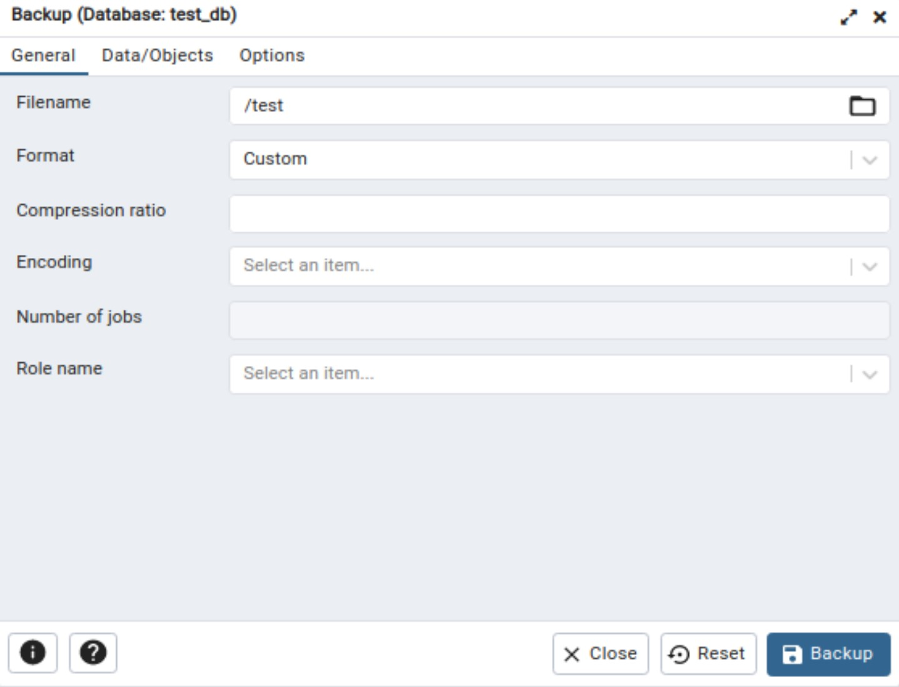

#  Лабораторная работа №2. Запросы DCL. Резервное копирование. 

> **Цель работы:** Получить теоретические и практические навыки импорта и экспорта данных в PostgreSQL, создания пользователей, включения их в группы и назначения им прав, а также создания полной версии бекапа и части данных. 

## Средства выполнения 

* СУБД PostgreSQL 
* Средство администрирования pgAdmin

## Пункты задания для выполнения 

1. Изучить теоретические сведения лабораторной работы. 
2. Выполнить импорт данных из csv-файла в БД (2-мя способами - с помощью sql-команды и с помощью графического интерфейса pgAdmin).  
3. Выполнить экспорт данных из БД в csv-файл (2-мя способами - с помощью sql-команды и с помощью графического интерфейса pgAdmin).   
4. Создать нового пользователя БД.
5. Назначить ему права на чтение таблицы через группу.
6. Отозвать права на чтение таблицы.
7. Назначить пользователю все привелегии на таблицу напрямую. 
8. Сменить пользователю пароль (с помощью команды ALTER).
9. Выполнить бэкап БД и восстановление с помощью утилит pg_dump и psql. 
10. Выполнить бэкап БД и восстановление с помощью pgAdmin. 
11. Защитить лабораторную работу.


## Теоретическая часть
### Импорт данных из .csv-файла

Предполагается, что у вас уже есть необходимый .csv-файл, и первое, что нужно сделать, это перейти pgAdmin и создать там новую базу данных. Ну или воспользоваться уже существующей, в зависимости от текущих нужд. В данном случае была создана БД test_db.

В выбранной БД создается таблица с полями, типы которых должны соответствовать «колонкам» в выбранном .csv-файле.


Вводим команду на импорт данных из файла:
```sql
COPY person FROM '/home/people.csv' DELIMITER ',' CSV HEADER;
```
> *Примечание:* если БД развернута в docker контейнере, то перед выполнением команды COPY необходимо скопировать файл csv в контейнер с помощью команды: <docker cp /home/student/people.csv postgres:/home/>

Проверяем, что данные были загружены:


### Экспорт данных в .csv-файл

Предположим, нам надо сохранить таблицу person в csv файл.

Для этого выполним команду:
```sql
COPY person TO '/home/people_1.csv' DELIMITER ',' CSV HEADER;
```

Существует и другой способ экспорта через pgAdmin: правой кнопкой мыши по нужной таблице – экспорт – указание параметров экспорта в открывшемся окне.


### Создание резервной копии с помощью pg_dump

Для создания бэкапа БД на Postgres воспользуемся утилитой pg_dump. Она позволяет сделать резервную копию таблицы, базы, схемы или данных.

Идея, стоящая за этим методом, заключается в генерации текстового файла с командами SQL, которые при выполнении на сервере пересоздадут базу данных в том же самом состоянии, в котором она была на момент выгрузки. Подробнее можно ознакомиться [тут](https://postgrespro.ru/docs/postgresql/9.6/backup-dump).

Перейдём в целевой каталог, в котором планируется сохранить файл бэкапа и выполним команду:

```
pg_dump имя_базы -h хост -p порт -U пользователь > имя_файла_бэкапа.sql
```

Разумеется, подключиться можно как к локальной базе, так и к базе, расположенной на сервере. После того, как файл создался, можем приступить к созданию копии.

Для начала создайте базу (её имя может быть любым), а также пользователя, имя которого должно совпадать с именем пользователя, который работает с исходной базой. Скорее всего, это имя, которое вы использовали для параметра -U в команде, указанной выше. Но точнее лучше посмотреть в полученном файле бэкапа. В скрипте создания таблиц можно увидеть строчку вида:

```sql
ALTER TABLE имя_базы OWNER TO имя_пользователя;
```

Здесь именно то имя, которое должно быть в новой базе. И в качестве owner для новой базы тоже лучше указать его.

Затем выполняем команду:
```
psql имя_новой_базы < имя_файла_бэкапа.sql имя_пользователя
```

Такой короткий вариант команды возможен, если копию мы разворачиваем на локальной машине. Если же требуется развернуть на удалённой базе, то нужно будет также указать хост, порт и имя пользователя аналогично тому, как мы это делали при создании бэкапа.

### Создание резервной копии с помощью pgAdmin

Резервное копирование также можно выполнить через графический интерфейс pgAdmin.

Заходим в pgAdmin, находим нужную базу данных, нажимаем правой кнопкой мыши на нее и выбираем Backup. В появившимся окне нажимаем на троеточие (выбор папки). Выбираем нужную папку, далее (когда уже определились с папкой) вводим название будущего файла без расширения. На скриншоте test – это не папка, а как раз название будущего файла. Запускаем Backup.



Если все прошло успешно, то в выбраном месте у вас появится файл с копией базы данных.

Для восстановления из резервной копии создаем новую БД. После выбираете созданную новую базу данных и кликаете правой кнопкой мыши по ней. В контекстном меню выбираете Restore. После нажимаете на троеточие и выбираете файл с бекапом. Нажмите Restore:


Все, база данных восстановлена из резервной копии.

### Контрольные вопросы  

1. Какой командой выполняется импорт csv-файла? Опишите структуру.
2. Что такое DCL? Какие операторы туда вхолдят?
3. В чем заключается отличие пользователя от роли в PostgreSQL? 
4. Перечислите способы создания пользователя.
5. Опишите структуру команды GRANT. 
6. Опишите структуру команды REVOKE.
7. С помощью какой команды можно сменить пароль пользователя?
8. Перечислите способы создания резервной копии.
9. Что является результатом выполнения программы pg_dump?
10. Какой командой выполняется восстановление БД из резервной копии?