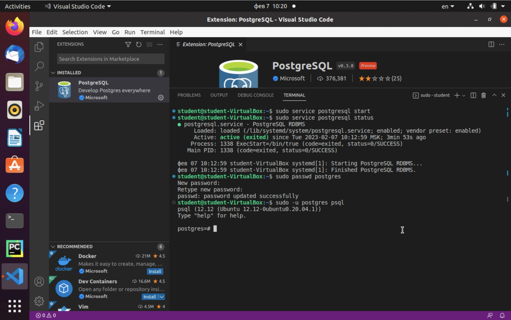
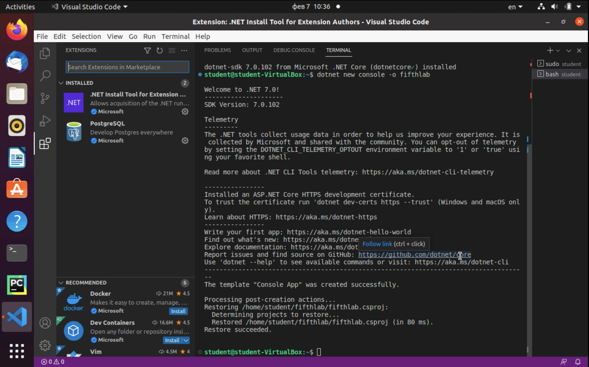
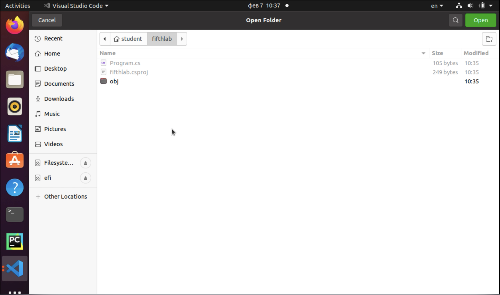
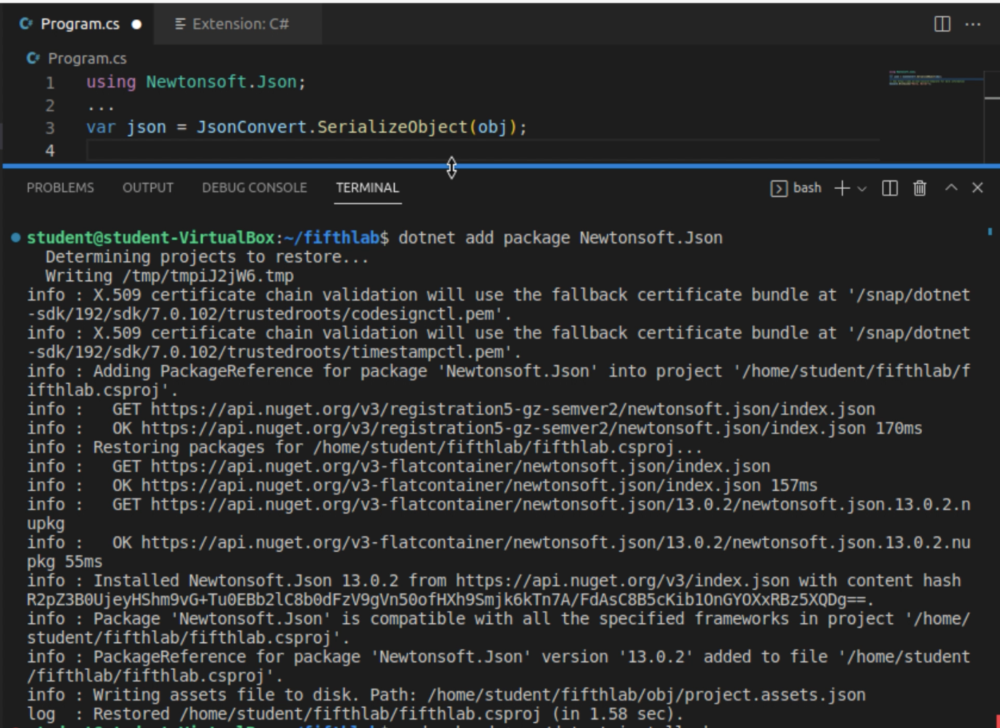
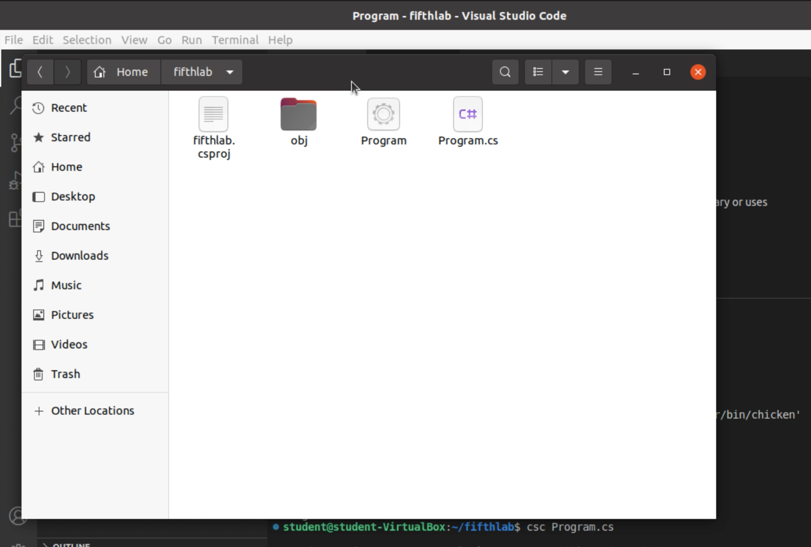

#  Лабораторная работа №5. Создание приложения на C#.

> **Цель работы:** Получить теоретические и практические навыки создания оконных приложений в VS Code с использованием базы данных в СУБД PostgreSQL.

## Средства выполнения 

* СУБД PostgreSQL 
* VS Code

## Пункты задания для выполнения 

1. Изучить теоретические сведения лабораторной работы. 
2. Настроить соединение VS Code c PostgreSQL.  
3. Подготовка VS Code.
4. Создание оконного приложения.

## Теоретическая часть

### Где мы будем выполнять лабораторную?

Visual Studio Code – это один из наиболее популярных редакторов кода, разработанный корпорацией Microsoft. Он распространяется в бесплатном доступе и поддерживается всеми актуальными операционными системами: Windows, Linux и macOS. VS Code представляет собой обычный текстовый редактор с возможностью подключения различных плагинов, что дает возможность работать со всевозможными языками программирования для разработки любого IT-продукта.

Первое, что бросается в глаза, – это блок кода, для которого отведено больше всего места. Название функций и прочее подсвечено разными цветами. Здесь же указан путь до файла, а чуть выше расположены вкладки-файлы, по которым можно перемещаться. С помощью них мы можем добавлять не просто один файл с кодом, а целый проект.

Следующий блок – левая панель управления, включающая в себя 5 основных вкладок: «Проводник», «Поиск», «Система управления версиями», «Запуск кода» и «Расширения». Первая предоставляет пользователю возможность просматривать содержимое проекта и быстро перемещаться внутри него.

Вторая вкладка – поиск. Используется для нахождения слов в документе. Он также может быть запущен с помощью комбинации клавиш «CTRL+SHIFT+F». Алгоритм использования довольно прост – вводим название в поиск и смотрим результат.

Еще одна важная вкладка, с помощью которой из Visual Studio Code можно сделать функциональную утилиту, это «Расширения». В ней находятся установочники для всех популярных инструментов, используемых разработчиками.

### Кто такой этот ваш C#?

C# (читается как «Си шарп») — это язык программирования от компании Microsoft. Изначально его создавали для проектов под Windows, но теперь это по-настоящему универсальный язык: на нём пишут игры, десктопные приложения, веб-сервисы, нейросети и даже графику для метавселенных.

Один из ведущих разработчиков языка — легендарный Андерс Хейлсберг, который до C# успел сделать Turbo Pascal и Delphi, а после — TypeScript (майкрософтовский JS на стероидах).

Если коротко, этот язык:

Кросс-платформенный — запускается почти на любом железе.
 * Объектно-ориентированный — состоит из классов и объектов, которые умеют передавать свойства друг другу.
 * Постоянно развивается — для тех, кто любит учиться.
 * Дружит с экосистемой Windows — для этого и был написан.

Запуск любой программы на C# начинается с главной функции — Main(). В ней прописано, как программа будет себя вести дальше — что за чем пойдёт, что за что отвечает и так далее. Выполняется она из главного класса — назовём его HelloWorld. Если перевести это на программистский, получится как-то так:

```js
using System; // Создаём место, где будет лежать наша программа. Его называют пространством имён.
class HelloWorld { //Задаём главный класс и даём ему имя -- «HelloWorld». 
  static void Main() { //Объявляем главную функцию.
//Вставляем сюда любой код. Например, можно научить программу с нами здороваться:
            Console.Write("Как тебя зовут? ");
            string name = Console.ReadLine();
            Console.WriteLine("Привет, " + name + "!");
  }
}
```

#### Преимущества C#

Независимость от железа. Программисту не надо адаптировать программу под разные платформы и системы — за него это делает виртуальная машина, вшитая в .NET Framework. В итоге один и тот же код можно запускать на любых устройствах — смартфонах, компьютерах, серверах, банкоматах и даже умных часах.

Отличная совместимость с Windows. Не зря же язык разработали именно в Microsoft. Так же как Swift идеально подходит для программирования под экосистему Apple, C# прекрасно вписывается в экосистему Windows.

Управление памятью. Чтобы программа работала стабильно, её надо иногда чистить от ненужных объектов, ссылок, кэша и прочего мусора. В C# это происходит автоматически — разработчику не надо следить за расходом памяти, бороться с её утечками или удалять мёртвые куски кода.

Строгая типизация. Когда вы объявляете переменную в C#, надо сначала указать, что в ней лежит — строка, число или массив. Так разрабатывать чуть дольше, зато ваш код работает предсказуемо — числа взаимодействуют с числами, строки со строками и так далее. В языках со слабой типизацией свободы и драйва больше, но есть шанс пропустить ошибку, которая всплывёт в готовой программе.

Большое сообщество. На С# пишут более миллиона программистов по всему миру. В соцсетях полно чатов и сообществ «шарпистов», где можно задать вопрос, обсудить сложную тему или найти готовое решение. В теории можно даже найти ментора, который поделится знаниями и поможет быстрее освоить язык.

Синтаксический сахар. В С# есть много способов сократить код, не нарушая логику программы. Программисты называют такие приёмы «синтаксическим сахаром» — они помогают сделать код проще, понятнее и в целом симпатичнее. Сравните, например, как выглядит сложение чисел с «сахаром» и без.

#### Недостатки языка

Есть у C# и недостатки, причём довольно серьёзные, — давайте разберём и их тоже.

Скорость. Когда мы запускаем программу на C#, код исполняется не сразу, а сначала адаптируется под нужное железо. Так мы охватываем больше платформ, но теряем в скорости — программе нужно сделать двойную работу, чтобы просто стартовать. Из-за этого интерфейсы на С# иногда подтормаживают при первом запуске.

Безопасность. Эксперты говорят, что код на C# легко декомпилировать — то есть перевести из машинного обратно в человеческий. Проблема в том, что так программу может легко прочитать хакер или конкурент — и изучить её уязвимости, украсть фрагменты кода или написать для неё вредоносный софт.

Мало доступа к железу. Так как С# — язык высокого уровня, на нём редко пишут проекты, где нужно полное взаимодействие с железом, — игровые движки, операционные системы, авиационный софт и так далее. Та же Unity целиком написана на низкоуровневом языке C++, хотя и умеет исполнять С#-команды.

### Немного про оконные приложения

Оконное приложение Windows - это класс приложений, использующих для взаимодействия с пользователем элементы графического пользовательского интерфейса, то есть объекты типа: окна, кнопки, поля ввода, элементы контроля и многие другие. При помощи устройств ввода (клавиатуру/мышь/тачпад и прочие), пользователь имеет возможность взаимодействовать с объектами оконного приложения: перемещать, активировать, прокручивать. Примером данного класса являются классические графические приложения, работающие с окнами.

Для создания графических приложений на C# можно использовать .NET CLI, но также можно использовать бесплатную и полнофункциональную среду разработки - Visual Studio Code, которая в ряде случаев облегчает проектирование приложения. 

Платформа .NET Framework — это технология, которая поддерживает создание и выполнение веб-служб и приложений Windows. При разработке платформы .NET Framework учитывались следующие цели.
* Обеспечение согласованной объектно-ориентированной среды программирования для локального сохранения и выполнения объектного кода, для локального выполнения кода, распределенного в Интернете, либо для удаленного выполнения.
* Предоставление среды выполнения кода, в которой:
сведена к минимуму вероятность конфликтов в процессе развертывания программного обеспечения и управления его версиями;
гарантируется безопасное выполнение кода, включая код, созданный неизвестным или не полностью доверенным сторонним изготовителем;
исключаются проблемы с производительностью сред выполнения скриптов или интерпретируемого кода;
* Обеспечиваются единые принципы разработки для разных типов приложений, таких как приложения Windows и веб-приложения;
* Обеспечивается взаимодействие на основе промышленных стандартов, которое гарантирует интеграцию кода платформы .NET Framework с любым другим кодом.

### Подключение PostgreSQL к VS Code 

Запустим VS Code и подключимся к серверу PostgreSQL. Для этого:

1. Получим расширение PostgreSQL (от Microsoft) в VSCode Marketplace [см. здесь](https://marketplace.visualstudio.com/items?itemName=ckolkman.vscode-postgres) 
2. Установим Postgres: ```sudo apt установите postgresql postgresql-contrib``` 
3. Проверим версию: ```psql --version```

Как только мы получите номер версии, следующее, что нужно сделать, это иметь возможность контролировать, работает база данных или нет, используя ```sudo service postgresql [start/stop]``` для запуска или остановки сервера. Чтобы проверить статус, вместо этого введите ```sudo service postgresql status```

Cледующее, что yам нужно сделать, это установить пароль по умолчанию для пользователя по умолчанию, который настроен для нас: образное имя пользователя «postgres». Запустите ```sudo passwd postgres```, чтобы установить пароль.
Вы также можете открыть командную строку: ```sudo -u postgres psql```



Теперь вы можете заметить, что вы можете запустить базу данных, но не можете сделать что-либо еще.

Вот что делать, если у вас есть эта проблема.
1. Откройте командную строку (используя код из предыдущего абзаца) и введите \du.
Здесь, если вы видите «postgres» в качестве единственного значения в столбце «Имя роли», и кроется ваша проблема.
2. Добавьте свое собственное имя пользователя WSL в качестве суперпользователя: ```CREATE USER [ваше имя пользователя WSL] SUPERUSER```
3. Создайте пароль для этого суперпользователя: ```ALTER USER [имя пользователя] PASSWORD [пароль]```
Наконец, нажмите Ctrl+Alt+P в VSCode и введите «PostgreSQL: Connect».

Вы можете просмотреть существующие базы данных, набрав \l в оболочке psql.
Если вы размещаете локально, то имя сервера — localhost.
Если вы хотите подключиться к базе данных по умолчанию, оставьте поле имени базы данных пустым, но в противном случае используйте имя базы данных, которое вы нашли из первого пункта (или создайте его в оболочке!)
На этом этапе вы можете использовать либо свое имя пользователя WSL, либо «postgres» в качестве имени пользователя. Следующее поле запрашивает пароль, который вы установили ранее.
Наконец, он запрашивает порт. Обычно это 5432.
Теперь, соединение настроено. Подтверждение появится в правом нижнем углу экземпляра VSCode с подробным описанием хоста, имени пользователя и базы данных. 

### Подготовка VS Code

Для начала устанавливаем SDK. Детальная инструкция лежит [здесь](https://github.com/dotnet/core/blob/main/release-notes/download-archives/2.0.0-download.md)

После этого в папке с проектами выполняем команду ```dotnet new console -o fifthlab```
Результатом работы этой команды будет консольный проект fifthlab в соответствующей папке.





Теперь открываем созданную папку в VSCode и ставим расширение C# от Microsoft. Не забываем перезагрузить окно после установки расширения. Среда разработки предложит создать ассеты для проекты, соглашаемся. После этого в папке .vscode будут созданы 2 файла: launch.json и tasks.json. Они нужны для запуска приложения из среды и отладки.

Все, теперь мы можем запускать приложение из VSCode и отлаживать. Запускать можно и из консоли, выполнив команду
```dotnet run```

Зависимости подключаются с помощью команды
```dotnet add package```

подключим к нашему приложению библиотеку Newtonsoft.Json
```dotnet add package Newtonsoft.Json```

VSCode предложит нам восстановить зависимости. Соглашаемся.

Теперь мы можем использовать библиотеку

```js
using Newtonsoft.Json;
...
var json = JsonConvert.SerializeObject(obj);
```



Для того чтобы оконное приложение могло взаимодействовать с БД необходимо создать подключение с сервером БД Postgres. Для этого будем использовать NuGetPkgManager.

* Скачаем с сайта Github реппозиторий: [Npgsql](https://github.com/npgsql/npgsql)

* Распакуем, откроем через Visual Studio и произведем сборку проекта Npgsql 

* В результате описанных выше процедур в папке окажется файл Npgsql.dll. После чего этот файл необходимо скопировать в директорию с исходными кодами проекта, в котором будет использоваться соединение с PostgreSQL. Подключаем в требуемом месте заголовок using Npgsql.


### Создание оконного приложения

Чтобы создать форму:
1. В пустом файле введите следующие операторы using:

```js
using System;
using System.ComponentModel;
using System.Drawing;
using System.Windows.Forms;
```
2. Объявите класс с именем Form1, который наследуется от класса Form:

```public class Form1 : Form```

3. Создайте конструктор без параметров для Form1.
Вы добавите дополнительный код в конструктор в следующей процедуре.

```public Form1() {}```

4. Добавьте в класс метод Main.

```js
[STAThread]
public static void Main()
{
  Application.EnableVisualStyles();
  Application.Run(new Form1());
}
```
С подробным примером создания оконных приложений на С# можно ознакомиться [здесь](https://learn.microsoft.com/ru-ru/visualstudio/data-tools/create-a-simple-data-application-by-using-adonet?view=vs-2022&tabs=csharp)

5. Чтобы начать использовать Npgsql нам понадобится сервер Postgre(Очевидно) и некоторая информация о подключении к серверу.
Подключение к серверу формируется при помощи так называемых ConnectionString. Для PostgreSQL имеющих следующий формат:
```js
string conn_param = "Строка подключения к базе"; //Например: "Server=127.0.0.1;Port=5432;User Id=postgres;Password=mypass;Database=mybase;"
string sql = "текст запроса к базе данных";
NpgsqlConnection conn = new NpgsqlConnection(MainParams.ConnectionString);
                NpgsqlCommand comm = new NpgsqlCommand(sql, conn);
                conn.Open(); //Открываем соединение.
                result = comm.ExecuteScalar().ToString(); //Выполняем нашу команду.
                conn.Close(); //Закрываем соединение.
```
* Для выполнения команд используется объект класса NpgsqlCommand следующим образом:

```js
NpgsqlCommand npgc = new NpgsqlCommand("ЗАПРОС", nc);
int rows_changed=npgc.ExecuteNonQuery();//Если запрос не возвращает таблицу
NpgsqlDataReader ndr = npgc.ExecuteReader()//Если запрос возвращает таблицу
```

*Данный пример показан лишь для демонстрации, весь код - пишите сами для своей темы!*

6. Чтобы скомпилировать и запустить приложение в командной строке .NET Framework перейдите в каталог, в котором вы создали класс Form1.

7. Введите: ```csc form1.cs```

8. В папке проекта пояфился файл: ```Form1.exe```



### Контрольные вопросы  

1. Какие типы данных используются в PostgreSQL? 
2. Что такое оконное приложение Windows? Какие манипуляции оно вопылняет?
3. Что такое .NET Framework?
4. Назовите цели .NET Framework.
5. За что отвечает модуль Npgsql?
6. Опишите структуру команды INSERT для заполнения таблицы. 
7. Опишите структуру команды DELETE для удаления записей из таблицы.
8. Области применения языка C#
9. Опишите стркутуру приложения VS Code
10. Преимущества и недостатки языка C#
