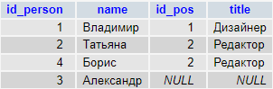
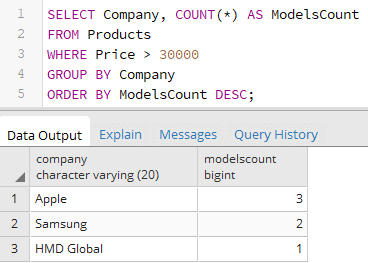
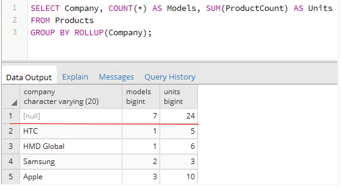
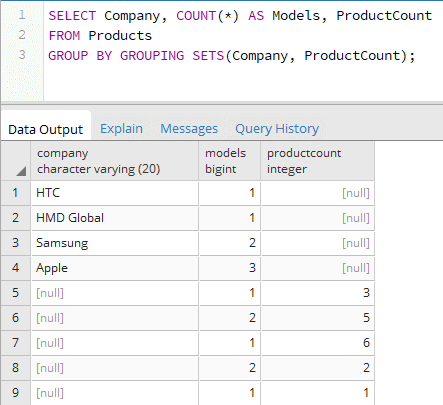

#  Лабораторная работа. Запросы Select 
## **DISTINCT, LIMIT**
*DISTINCT* - PostgreSQL оператор DISTINCT используется для удаления дубликатов из набора результатов. DISTINCT может использоваться только с операторами SELECT.
Пример - SELECT DISTINCT "Столбец" from "Таблица"

*LIMIT* - позволяет ограничить количество записей, которые будут выведены в результате работы SELECT. 
Пример - SELECT "Столбец" from "Таблица" LIMIT 8
В данном случае будет выведено только 8 записей

# **Join, Group by, Order by**
## **Join**
Допустим, что мы хотим получить данные из двух таблиц, как нам это сделать? Первое что приходит в голову - SELECT, но это довольно муторно. Для того, чтобы не мучиться был придуман оператор JOIN
Как он работает? Очень просто, т.к. оператор бинарный, то он должен работать с 2 объектами, в нашем случае объектами являются таблицы базы данных. Join получает таблицы, которые нужно объединить и критерий для объединения.
Звучит, пожалуй, сложно, поэтому давайте рассмотрим на примере более подробно.
Итак, у нас в примере будет 2 таблицы, а именно: таблица Persons с полями id_person, name, position_ref, а также таблица Positions с полями id, title.


Теперь необходимо определиться с тем по какому критерию мы будем объединять таблицы. В данном случае все довольно очевидно, и объединим мы их по единственному подходящему выражению
```id_pos = position_ref```
Итоговый запрос будет выглядеть следующим образом:

```
SELECT id_person, name, id_pos, title 
FROM `persons`
INNER JOIN `positions` ON id_pos = position_ref
```

Наиболее внимательные могли заметить приписку INNER перед JOIN. Здесь стоит разобрать все виды объединений. 
Всего их 3: INNER (Такое присоединение покажет нам данные из таблиц, только если условие связывания соблюдается), LEFT/RIGHT (здесь мы увидим все записи из левой/правой таблицы в то время, как поля из правой/левой будут добавлены по возможности)
LEFT и RIGHT JOIN отличаются лишь тем, какая из таблиц будет выведена полностью, так что нет смысла разбирать оба варианта. Ниже представлен пример работы LEFT JOIN.

```
SELECT id_person, name, id_pos, title 
FROM `persons`
LEFT OUTER JOIN `positions` ON id_pos = position_ref
```



«Левая» таблица persons, содержит строку id_person#3 — «Александр», где указан идентификатор должности, отсутствующей в словаре. Мы увидим все записи из «левой» таблицы, тогда как правая будет присоединена по возможности.
## **Group by**
Для группировки данных в PostgreSQL применяются операторы GROUP BY и HAVING, для использования которых применяется следующий формальный синтаксис:
```
SELECT столбцы
FROM таблица
[WHERE условие_фильтрации_строк]
[GROUP BY столбцы_для_группировки]
[HAVING условие_фильтрации_групп]
[ORDER BY столбцы_для_сортировки]
```

Для рассмотрения того, как работают данные операторы возьмем уже другую таблицу:

```
CREATE TABLE Products
(
  Id SERIAL PRIMARY KEY,
  ProductName VARCHAR(30) NOT NULL,
 Company VARCHAR(20) NOT NULL,
   ProductCount INT DEFAULT 0,
   Price NUMERIC NOT NULL,
   IsDiscounted BOOL
);

```

Главное предназначение данных операторов заключается в том, чтобы анализировать группы строк, полученные в результате отбора. Это применяется, когда мы хотим получить количество товаров определённого типа или посчитать их общий вес.

Давайте, к примеру, посчитаем количество телефонов разных компаний в нашей БД:



Важно понимать, что группировать можно по нескольким столбцам одновременно. Однако, если в столбцах будут содержаться NULL значения, то такие записи будут заноситься в отдельную группу.
Кроме того, PostgreSQL позволяет использовать 3 дополнительных параметра вместе с Group by. Чтобы их применить необходимо между Group by и столбцами группировки добавить сам параметр, например, вот так GROUP BY ROLLUP(Company);
1) ROLLUP. Оператор ROLLUP добавляет суммирующую строку в результирующий набор.



Как видно из примера, оператор ROLL UP создал суммирующую строку в которой указал общее число моделей и телефонов соответственно 
2) CUBE похож на ROLLUP за тем исключением, что CUBE добавляет суммирующие строки для каждой комбинации групп.


3) Оператор GROUPING SETS группирует получаемые наборы отдельно:
```
SELECT Company, COUNT(*) AS Models, ProductCount
FROM Products
GROUP BY GROUPING SETS(Company, ProductCount);
```

В выражении SELECT производится выборка компаний, количества моделей и количества товаров. То есть мы получаем три категории. Оператор GROUPING SETS производит группировку по двум столбцам - Company и ProductCount. В итоге будет создаваться две группы: 1) компании и количество моделей и 2) количество моделей и количество товаров.




## **Having**
Последнее, что мы изучим в данной лабораторной работе, это - HAVING. Довольно часто можно видеть этот оператор в паре с Group by и вот почему: HAVING позволяет проводить фильтрацию групп, полученных в результате группировки.
Например, если я не хочу, чтобы группы, в которых количество телефонов меньше одного, выводились на экран. Для этого я просто добавлю параметр HAVING COUNT(*)> 1


Таким образом мы можем задать дополнительные параметры для фильтрации групп, такие как COUNT, SUM и т.п.
## **Агрегирующие функции**
Эта часть материала является скорее вспомогательной и просто описывает принцип работы max/min, avg, count и sum.
*max/min* - позволяет извлечь максимальное значение из диапазона. Предположим, что у нас есть таблица с диапазоном температур и мы хотим получить из этого набора максимальную. Сразу в голову приходит идея прописать следующий код: max("Столбец температур")
Однако такой вариант работать в совокупности с where не будет. Правильный способ выглядит вот так: (SELECT max("Столбец температур") FROM "Таблица погоды")

*count* Функция COUNT (*) возвращает количество строк, возвращаемых оператором SELECT.
Когда вы применяете функцию COUNT (*) ко всей таблице, PostgreSQL должен сканировать всю таблицу последовательно. Если вы используете функцию COUNT(*) для большой таблицы, запрос будет медленным.
Пример запроса - SELECT COUNT(*) FROM table_name;

*avg* - возвращает среднее значение из диапазона значений столбца. Пример - SELECT AVG("Столбец")  FROM "Таблица";

*sum* - суммирует значения столбца в таблице. Может применяться, когда нам нужно посчитать общий вес товара на складе. Пример - SELECT SUM("Столбец")  FROM "Таблица";
## **Where и его условия**
Для фильтрации данных применяется оператор WHERE, после которого указывается условие, на основании которого производится фильтрация:  WHERE "условие"
Если условие истинно, то строка попадает в результирующую выборку. В качестве можно использовать операции сравнения. Эти операции сравнивают два выражения. В PostgreSQL можно применять следующие операции сравнения:
1)=: сравнение на равенство
2)<>: сравнение на неравенство
3)<: меньше чем
4)>: больше чем
5)!<: не меньше чем
6)!>: не больше чем
7)<=: меньше чем или равно
8)>=: больше чем или равно

Подробнее можно прочитать в официальной документации!

ССЫЛКА НА ОФИЦИАЛЬНУЮ ДОКУМЕНТАЦИЮ https://www.postgresql.org/docs/

## **Join трех таблиц**
Join 2 таблиц ничем не отличается от join'a большего числа таблиц. Для наглядности возьмем следующую структуру бд, на основе которой и пропишем наш join.
```
 categories|   goods      |  orders
 --------- |--------------|-------------
 id(Pk)    |  id(Pk)      |  id(Pk)
 title     |  name        |  items_id
 ----      |  category_id |  ---
```

Сам запрос будет выглядеть вот так:

```
SELECT categories.title, goods.name, goods.id  *Здесь мы выбираем поля из уже объединенной таблицы, которые хотим вывести
FROM (categories
INNER JOIN goods
ON categories.id = goods.category)  *Здесь мы сначала соединяем таблицы категории и товары, а следующим шагом соединим таблицу из этих двух с таблицей заказов
INNER JOIN orders
ON orders.items_id = goods.id
ORDER BY categories.id;    *Собственно присоединяем еще одну таблицу
```

Таким образом объединение нескольких таблиц происходит последовательно. Также при необходимости мы можем добавлять условия WHERE и т.п. Пример:

```
SELECT categories.title, goods.name, goods.id  
FROM (categories
INNER JOIN goods
ON categories.id = goods.category WHERE _условие_)  
INNER JOIN orders
ON orders.items_id = goods.id WHERE _условие_
ORDER BY categories.id; 
```

# **Задание**
1.Обязательное задание по вариантам.
Необходимо создать 2 таблицы в каждой из которых будет не менее 4 столбцов и не менее 12 записей (нужно чтобы было хотя бы 2 дубликата). После этого по варианту из таблицы применить join с использование агрегирующей функции и сгруппировать. Кроме того, необходимо продемонстрировать умение работать с LIMIT и DISTINCT.


2. Задание на +1 балл:
Изменить таблицы из пункта 1 так, чтобы были текстовые поля, а также значения NULL. Добавить дополнительную фильтрацию на основе текстовых полей. Добавить запрос, который заменить все пустые(NULL) значения на произвольные (выбранные студентом или преподавателем).
3. Задание на еще 1 дополнительный балл:
К результату из пункта 2 присоединить еще одну таблицу на основе любого поля, а также отсортировать вывод с помощью ORDER BY.

ПРИМЕЧАНИЕ. Необходимо показывать выполнение заданий последовательно (выполнение доп. задания возможно только после сдачи предыдущего пункта).

# **Контрольные вопросы**
1. Что такое join и для чего они нужны? 
1. Какие бывают join и в чем их отличие?
1. Как можно группировать данные?
1. Для чего вообще группируют данные?
1. Какие дополнительные параметры для Group By есть в PostgreSQL? Что делает каждый из них?
1. Для чего используется Having?
1. Какой синтаксис у JOIN, Group By, Having?
