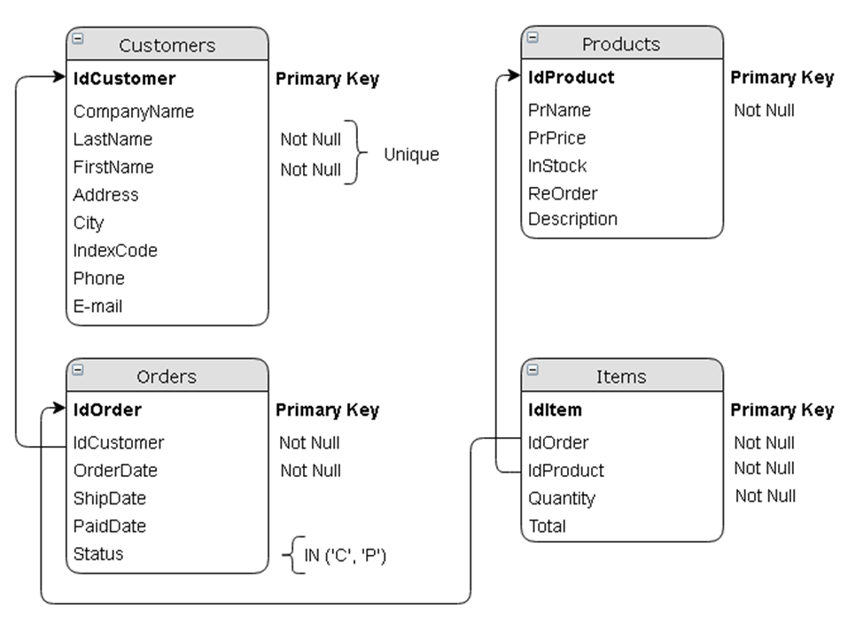
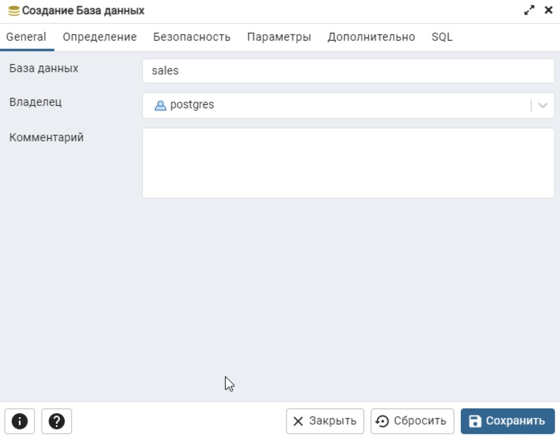
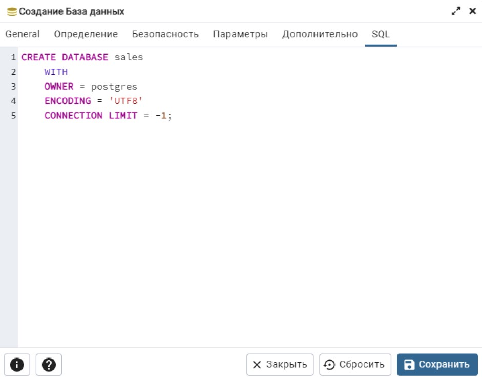
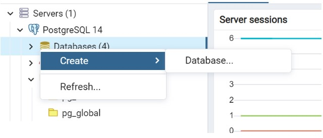
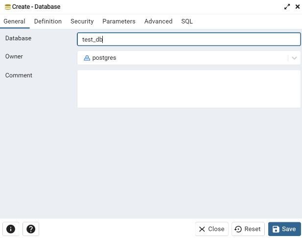
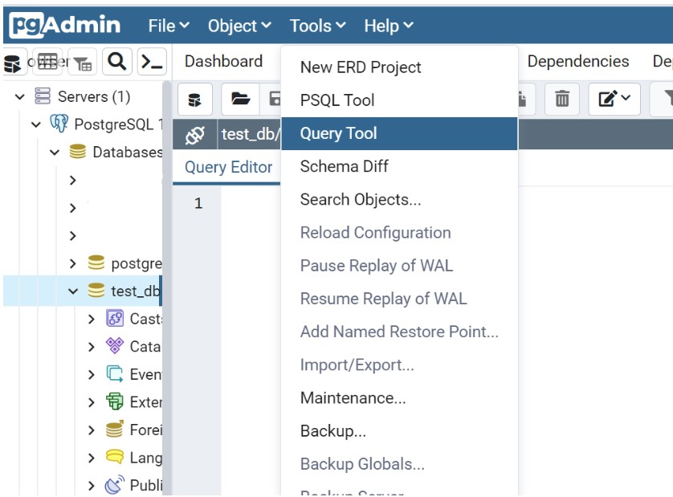
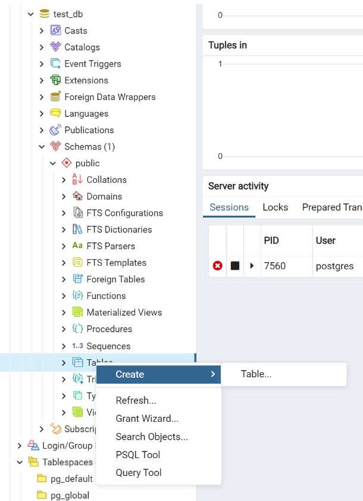
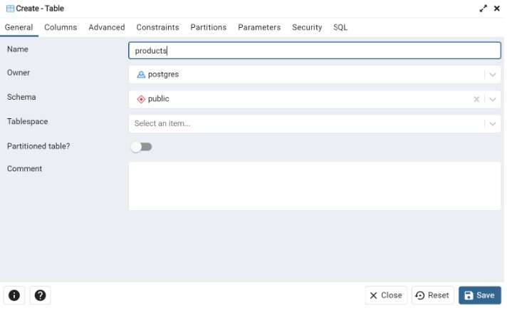
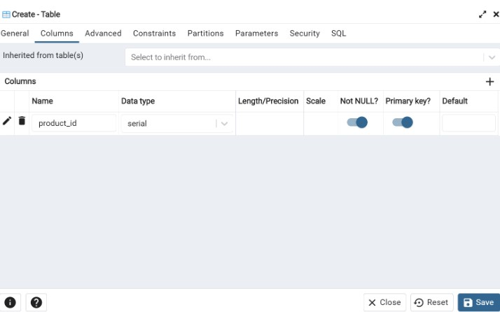

#  Лабораторная работа №1. Создание базы данных в СУБД PostgreSQL. Основы программирования на языке SQL. 

> **Цель работы:** Получить теоретические и практические навыки создания базы данных в СУБД PostgreSQL, изучить основные понятия и операторы, сформировать знания и умения программирования на языке SQL, приобрести практические навыки работы со средствами языка SQL для обновления, удаления и вставки данных в БД. 

## Средства выполнения 

* СУБД PostgreSQL 
* Средство администрирования pgAdmin

## Пункты задания для выполнения 

1. Изучить теоретические сведения лабораторной работы. 
2. Через PgAdmin соединиться с PostgreSQL и создать базу данных.  
3. В БД создать таблицы (две с помощью SQL-запросов и две с помощью графического интерфейса).  
4. Изменить одну из созданных таблиц с помощью команды ALTER TABLE. 
5. Создать ограничение на уникальность по двум столбцам (например, имя + фамилия). 
6. Создать ограничение на проверку данных. 
7. Создать значение по умолчанию. 
8. Заполнить каждую таблицу базы данных (минимум 7 записей в каждую таблицу) с помощью команды INSERT. ПРИМЕЧАНИЕ: для просмотра содержания таблиц необходимо использовать запрос SELECT * FROM <название таблицы> 
9. Изучить команду для обновления данных в таблицах. 
10. Изучить команду для удаления данных из таблиц. 
11. Защитить лабораторную работу.

## Пример таблиц 

Таблица **Customers** будет хранить такую информацию о клиентах, как название фирмы, фамилия, имя, адрес, город, индекс, телефон. 

Таблица **Orders** будет содержать подробную информацию о заказах — номер заказа, идентификатор покупателя, даты отправки и оплаты, а также статус заказа ('С' - Cancelled отменен, 'P' - Processed обработан, 'A'- adopted принят), идентификатор продукта и заказанное количество.  

Таблица **Products** будет хранить такую информацию о продукте, как название, цена продукта, его количество на складе, необходимость перезаказа и описание.  

Таблица **Items** содержит идентификатор заказа, идентификатор продукта в заказе и его количество, общую сумму по данной позиции.



## Теоретическая часть
### Краткие сведения по PostgreSQL

PostgreSQL является объектно-реляционной СУБД, т.е. объединяет реляционную модель с принципами объектно-ориентированного подхода. В методических указаниях используется PostgreSQL версии 14. 

В PostgreSQL область, где хранятся файлы баз данных, называется кластер. В файловой системе кластер хранится как каталог, содержащий все данные. Список баз данных подгружается из этого каталога при запуске сервера. 
Расположение кластера задается при установке самой PostgreSql на ваш ПК. Подробнее про физическое размещение баз можно прочитать [здесь](https://postgrespro.ru/docs/postgresql/14/storage).

### Компоненты СУБД PostgreSQL

* **Tables (Таблицы)**. Таблицы базы данных предназначены для хранения данных. Таблица состоит из строк и столбцов. Число столбцов и их порядок фиксированы, для каждого столбца определено имя и тип данных. Число строк переменно и отражает текущее количество данных, находящихся в таблице. 

* **Views (Представления)**. По сути своей являются «виртуальными таблицами». Представление - это поименованный запрос SELECT. 
Indexes (Индексы). Существуют для поддержания вместе с данными информации об их упорядоченности по различным критериям, что позволяет существенно повысить производительность некоторых операций, в частности поиска данных. Индексы существуют непосредственно вместе с таблицами и не имеют смысла сами по себе. Индексирование может быть выполнено по одному или нескольким столбцам и произведено в любой момент. 

* **Keys (Ключи)**. Подобно индексам, ключи не существуют сами по себе. Ключ - один из типов ограничений целостности. 

* **Defaults (Умолчания)**. Не существуют отдельно от таблиц. Умолчания определяют, какие значения будут подставлены в поле данных при добавлении строки, если значение не задано явно. Rules (Правила). Механизм, предназначенный для установления ограничений на диапазон возможных значений поля таблицы или нового типа данных, определяемого пользователем. 

* **Constraints (Ограничения целостности)**. Определяют диапазон возможных значений полей таблицы. 

* **Stored Procedures (Хранимые процедуры)**. Поименованный набор команд SQL. Хранимые процедуры располагаются на сервере вместе с базой данных и могут запускаться различными пользователями, имеющими соответствующие права. 

* **Triggers (Триггеры)**. Не существуют отдельно от таблицы. Триггер - специальный вид хранимой процедуры. Триггер может выполняться при изменениях данных или событиях в базе данных. 

* **User-defined data types, UDDT (Определяемые пользователем типы данных)**. Предоставляет специальный аппарат для создания пользовательских типов данных. 

* **User-defined functions, UDF (Определяемые пользователем функции)**. Представляет собой набор команд SQL, сохраненных в специальном виде. 

* **Users (Пользователи)**. Определяет список пользователей базы данных. Служит для работы механизма защиты данных. 

* **Roles (Роли)**. Роли пользователей - важный механизм для организации разграничения доступа. Пользователю может быть назначена одна или больше ролей. 


### Подключение PostgreSQL с использованием pgAdmin и создание БД 

Запустим pgAdmin и подключимся к серверу PostgreSQL. Для этого в левой части окна программы раскроем пункт **Servers**, который содержит набор серверов PostgreSQL. При установке последней версии устанавливается сервер, который по умолчанию имеет название PostgreSql 14. Нажмем на этот пункт, и нам отобразится окно для ввода пароля:



Здесь необходимо ввести пароль для суперпользователя postgres, который был задан при установке PostgreSQL. После успешного логина нам откроется содержимое сервера:



При входе в систему вы будете иметь пустую БД по умолчанию с названием "Postgres”.

### Создание базы данных в среде PgAdmin 

Выберите сервер и кликните правой кнопкой мыши на пункт Databases (Базы Данных) → Create → Database.



Введите название базы данных в поле Database. Нажать кнопку «Save».



### Создание таблиц

Таблицы создаются командой:

```sql
CREATE TABLE table_name ( 
    column1 datatype ограничение(если есть), 
    column2 datatype ограничение(если есть), 
    column3 datatype ограничение(если есть), 
    .... 
); 
```
где *column1*  – название столбца, *datatype* – стандартный или пользовательский тип данных, *ограничение* – накладываемое на столбец ограничение данных.

Если вам больше не нужна какая-либо таблица, или вы хотите пересоздать её по-другому, вы можете удалить её, используя следующую команду: 
```sql
DROP TABLE имя_таблицы;
```
Вы можете изменять структуру таблицы с помощью команды ALTER TABLE. Команда ALTER TABLE используется для добавления, удаления или модификации колонки в уже существующей таблице. 

Добавление столбца в таблицу: 
```sql
ALTER TABLE t1(pole1 char(10)); 
```

Изменение размера столбца таблицы: 
```sql
ALTER TABLE t1ALTER COLUMN name TYPE INTEGER; 
```

Удаление столбца таблицы: 
```sql
ALTER TABLE t1 DROP COLUMN pole1; 
```

С помощью команды ALTER TABLE можно изменить имя таблицы без реального переноса физической информации в БД: 
```sql
ALTER TABLE t1 RENAME TO t2;
```

### Типы данных 

Postgres Pro поддерживает стандартные типы SQL: int, smallint, real, double precision, char(N), varchar(N), date, time, timestamp и interval, а также другие универсальные типы и богатый набор геометрических типов. Кроме того, Postgres Pro можно расширять, создавая набор собственных типов данных. Как следствие, имена типов не являются ключевыми словами в данной записи, кроме тех случаев, когда это требуется для реализации особых конструкций стандарта SQL.

### Ограничения 

Ограничение-проверка — наиболее общий тип ограничений. В его определении вы можете указать, что значение данного столбца должно удовлетворять логическому выражению(проверке истинности). 

В Postgres поддерживаются следующие типы ограничений: на уникальность, на допустимость значения NULL, первичный ключ, внешний ключ, ограничения общего вида.

* **ограничения общего вида**

Пример синтаксиса: 
```sql
CREATE TABLE products ( 
    product_no integer, 
    name text, 
    price numeric CHECK (price > 0) 
);
```

Вы можете также присвоить ограничению отдельное имя. Это улучшит сообщения об ошибках и позволит вам ссылаться на это ограничение, когда вам понадобится изменить его. Сделать это можно так: 
```sql
price numeric CONSTRAINT positive_price CHECK (price > 0) 
```

То есть, чтобы создать именованное ограничение, напишите ключевое слово CONSTRAINT, а за ним идентификатор и собственно определение ограничения. (Если вы не определите имя ограничения таким образом, система выберет для него имя за вас.) 

* **ограничения NOT NULL** 

Ограничение NOT NULL просто указывает, что столбцу нельзя присваивать значение NULL. 

Пример синтаксиса: 
```sql
CREATE TABLE products ( 
    product_no integer NOT NULL, 
    name text NOT NULL, 
    price numeric 
); 
```

* **ограничения уникальности**

Ограничения уникальности гарантируют, что данные в определённом столбце или группе столбцов уникальны среди всех строк таблицы. Ограничение записывается так: 
```sql
CREATE TABLE products ( 
    product_no integer UNIQUE, 
    name text, 
    price numeric 
); 
```

Чтобы определить ограничение уникальности для группы столбцов, запишите его в виде ограничения таблицы, перечислив имена столбцов через запятую: 
```sql
CREATE TABLE example ( 
    a integer, 
    b integer, 
    c integer, 
    UNIQUE (a, c) 
); 
```

* **ограничение DEFAULT**

Установка для полей значений по умолчанию — это отличный способ избавить пользователя от излишней работы, если значения этих полей во всех записях, как правило, принимают одни и те же значения. Значение по умолчанию будет добавлено ко всем новым записям, если другое значение не указано. 

Пример синтаксиса: 
```sql
CREATE TABLE users ( 
    user_id int NOT NULL, 
    name varchar(255) NOT NULL, 
    fullname varchar(255), 
    gender int, 
    country varchar(255) DEFAULT 'Spain' 
); 
```

* **первичные ключи**

Ограничение первичного ключа означает, что образующий его столбец или группа столбцов может быть уникальным идентификатором строк в таблице. Для этого требуется, чтобы значения были одновременно уникальными и отличными от NULL. Таким образом, таблицы со следующими двумя определениями будут принимать одинаковые данные: 
```sql
CREATE TABLE products ( 
    product_id integer UNIQUE NOT NULL, 
    name text, 
    price numeric 
); 

CREATE TABLE products ( 
    product_id integer PRIMARY KEY, 
    name text, 
    price numeric 
); 
```

Первичные ключи могут включать несколько столбцов. Синтаксис похож на запись ограничений уникальности: 
```sql
CREATE TABLE example (
    a integer, 
    b integer, 
    c integer, 
    PRIMARY KEY (a, c) 
); 
```

При добавлении первичного ключа автоматически создаётся уникальный индекс-B-дерево для столбца или группы столбцов, перечисленных в первичном ключе, и данные столбцы помечаются как NOT NULL. 

Таблица может иметь максимум один первичный ключ. (Ограничений уникальности и ограничений NOT NULL, которые функционально почти равнозначны первичным ключам, может быть сколько угодно, но назначить ограничением первичного ключа можно только одно.) 

* **внешние ключи**

Внешние ключи позволяют установить связи между таблицами. Внешний ключ устанавливается для столбцов из зависимой, подчиненной таблицы, и указывает на один из столбцов из главной таблицы. Как правило, внешний ключ указывает на первичный ключ из связанной главной таблицы. 

Общий синтаксис установки внешнего ключа на уровне таблицы: 
```sql
[CONSTRAINT имя_ограничения] 
FOREIGN KEY (столбец1, столбец2, ... столбецN) 
REFERENCES главная_таблица (столбец_главной_таблицы1, столбец_главной_таблицы2) 
[ON DELETE действие] 
[ON UPDATE действие] 
```

Для создания ограничения внешнего ключа после FOREIGN KEY указывается столбец таблицы, который будет представляет внешний ключ. А после ключевого слова REFERENCES указывается имя связанной таблицы, а затем в скобках имя связанного столбца, на который будет указывать внешний ключ. После выражения REFERENCES идут выражения ON DELETE и ON UPDATE, которые задают действие при удалении и обновлении строки из главной таблицы соответственно. 

Например, определим две таблицы и свяжем их посредством внешнего ключа: 
```sql
CREATE TABLE Customers ( 
    Id INT PRIMARY KEY, 
    Age INT, 
    FirstName VARCHAR(20) NOT NULL, 
    LastName VARCHAR(20) NOT NULL, 
    Phone VARCHAR(20) NOT NULL UNIQUE 
); 

CREATE TABLE Orders ( 
    Id INT PRIMARY KEY, 
    CustomerId INT, 
    CreatedAt Date, 
    FOREIGN KEY (CustomerId) REFERENCES Customers (Id) 
);
```

### Пример создания таблицы с помощью SQL-запросов 

Для написания SQL-запросов откройте **Query Editor** в pgAdmin. Для этого откройте вкладку Tools и выберите Query Tool.



Создаем таблицу Orders, содержащую поля: id, customer_id, order_date, ship_date, paid_date, status.
```sql
CREATE TABLE IF NOT EXISTS orders( 
    order_id serial PRIMARY KEY, 
    customer_id int REFERENCES customers(customer_id),  
    order_date date NOT NULL default current_date, 
    ship_date date, 
    paid_date date, 
    status char(1) 
); 
```

* IF NOT EXIST позволяет перед создание таблицы проверить, что таблицы с таким название не существует, это помогает избежать лишних ошибок.

* Для того, чтобы для поля order_id применялось автоинкрементирование, нужно указать тип данных serial.

* Ограничение NOT NULL указывает, что ячейке столбца нельзя присваивать значение NULL. 

* Для столбца order_id определено ограничение в виде первичного ключа (PRIMARY KEY). 

* Ограничение REFERENCES указывает на то, что столбец является внешним ключом для таблицы customers. В скобках указан столбец, являющийся первичным ключом в этой таблице. Если в БД отсутствует таблица, на которую ссылается внешний ключ, запрос не выполнится. Поэтому сначала создайте таблицу сustomers, используя этот пример.  

* Для поля order_date  определено значение по умолчанию в виде текущей даты. В этом случае при добавлении записи о новом заказе в случае пропуска этого поля оно будет автоматически заполняться значением системной даты.

Попробуем изменить  таблицу с помощью команды ALTER TABLE. Добавим значение по умолчанию для столбца status: 
```sql
ALTER TABLE  orders ALTER COLUMN status SET DEFAULT 'A'; 
```

### Пример создания таблицы с помощью графического интерфейса PgAdmin

Для создания таблицы необходимо раскрыть Databases → Ваша база данных → Schemas. Нажать правой кнопкой мыши на Tables (Таблицы) и выбрать Create → Table.



В окне создания таблицы ввести название в поле Name.



Колонки в таблицах можно создать при создании таблицы. Для добавления колонки надо перейти во вкладку Columns, нажать на знак + и ввести данные о колонке. Также при необходимости можно выбрать таблицу, от которой наследуется данная таблицы. Сохранить таблицу. Нажать кнопку «Save».



### Использование операторов INSERT, UPDATE, DELETE 

В SQL заполнение таблиц производится при помощи следующей команды: 
```sql
INSERT INTO <имя таблицы>(<список столбцов>) VALUES (<список значений>); 
```
где *<имя_таблицы>* - таблица, куда вставляются данные, *<список столбцов>* - список полей, в которые вставляются данные (если он не указывается, то подразумевается заполнение всех полей). В списке полей поля указываются через запятую, *<список_значений>* - значение полей для вставки через запятую.

**Пример:** Добавление записи в таблицу Orders 
```sql
INSERT INTO Orders (order_id, customer_id, ship_date, status)    VALUES (1, 1, '12/02/2022', 'S'); 
```

Из таблицы можно удалить все столбцы, либо отдельные записи. Это осуществляется командой: 
```sql
DELETE FROM <Имя таблицы> [WHERE <Условие>] 
```
где *<Условие>* - условие, которым удовлетворяют удаляемые записи, если условие не указано, то удаляются все столбцы таблицы.

**Пример:** Удалить записи из таблицы Orders, у которых поле customer_id = 10. 
```sql
DELETE FROM Orders WHERE customer_id = 10; 
```

Также существует команда TRUNCATE для быстрого удаления всех данных из таблицы. 
```sql
TRUNCATE <Имя таблицы> 
```

Значение полей таблицы можно обновить (изменить), используя следующую команду: 
```sql
UPDATE <Имя таблицы> SET 
    <Имя поля1> = <Выражение1>, 
    [<Имя поля2> = <Выражение2>, ... ] 
    [WHERE <Условие>] 
```
Здесь *<Имя поля1>, <Имя поля2>* - имена изменяемых полей; 
*<Выражение1>, <Выражение 2>* - значения, которые должны принять поля; 
*<Условие>* - условие, которым должны соответствовать записи, поля которых изменяем. В качестве выражения можно использовать математические формулы.

**Пример:** для таблицы orders установить сегодняшнюю дату отправки для всех обработанных заказов 
```sql
UPDATE orders SET ship_date = CURRENT_DATE WHERE status='Р'; 
```

Для того, чтобы вывести, например, все записи таблицы пропишем Select запрос: 
```sql
SELECT * FROM orders; 
```

### Контрольные вопросы  

1. Что такое СУБД? 
2. В чем основное отличие объектно-реляционной СУБД? 
3. Назовите основные компоненты БД. Какие функции они выполняют? 
4. В чем заключается отличие таблиц от представлений? 
5. Какие типы данных используются в PostgreSQL? 
6. Опишите структуру запроса для создания таблицы. 
7. Что такое первичный ключ? Почему первичный ключ должен быть уникальным? 
8. Как реализуется связь между таблицами? Объяснить на примере запроса создания связи между таблицами с помощью внешних ключей. 
9. Для чего используются проверочные ограничения? Как создать ограничение на проверку? 
10. Зачем используются значения по умолчанию? Как установить значение по умолчанию? 
11. Опишите структуру команды INSERT для заполнения таблицы. 
12. Опишите структуру команды DELETE для удаления записей из таблицы. 
13. Опишите структуру команды UPDATE для записей из таблицы. 
14. Для чего нужна команда TRUNCATE?
15. Для чего нужна команда ALTER TABLE? 
16. Для чего нужна команда DROP TABLE? 