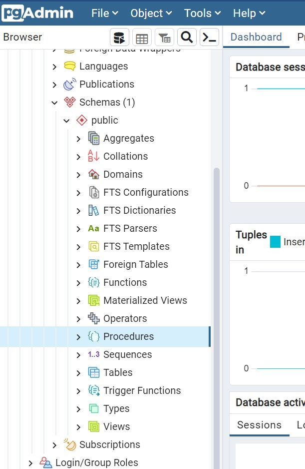
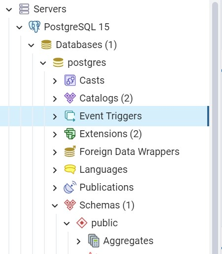

#  Лабораторная работа №6. Использование триггеров и хранимых процедур в PostgreSQL. 

> **Цель работы:** Изучить хранимые процедуры и триггеры в базах данных, приобрести практические навыки создания хранимых процедур и триггеров в PostgreSQL.

## Средства выполнения 

* СУБД PostgreSQL 
* Средство администрирования pgAdmin

## Пункты задания для выполнения 

1. Изучить теоретические сведения лабораторной работы. 
2. Создать следующие хранимые процедуры (в своей базе):
    a.	Пример из теоретической части лабораторной работы.
    b.	Хранимую процедуру для поиска информации по названию компании.
    c.	Хранимую процедуру для поиска товаров по диапазону цен.
    d.	Хранимую процедуру для поиска заказов по дате заказа и диапазону дат заказа, доставки.
    e.	Хранимые процедуры по заданию варианта.
3. Создать триггер INSERT.
4.	Создать триггер DELETE.
5.	Создать триггер UPDATE.
6.	Создать триггер, который при удалении записи из таблицы Products сначала удаляет все связанные с ней записи из таблицы Items, а затем удаляет саму запись из таблицы Products.
7.	Создать триггер, с использованием временной таблицы Inserted.
8.	Создать триггер DDL, который предотвратит удаление или изменение таблиц в базе данных.
9.	Подготовиться к защите лабораторной работы (уметь написать собственную процедуру/триггер).


## Хранимая процедура
### Теоретическая часть

Хранимая процедура – SQL-запрос, который имеет параметры, то есть он выполняется как обычная процедура. В зависимости от значения параметров хранимой процедуры мы получаем тот или иной результат запроса. Хранимые процедуры реализуют динамические запросы, выполняемые на стороне сервера.
Рассмотрим создание хранимых процедур при помощи команд языка SQL. Чтобы отобразить хранимые процедуры рабочей БД панели «Обозреватель объектов» нужно выбрать пункт «Schemas», а в нем – «Procedures». Нужно создать новую процедуру при помощи команд языка SQL, набрав код новой процедуры, который имеет следующий синтаксис:
```sql
CREATE [ OR REPLACE ] PROCEDURE
    name ( [ [ argmode ] [ argname ] argtype [ { DEFAULT | = } default_expr ] [, ...] ] )
{ LANGUAGE lang_name
    | TRANSFORM { FOR TYPE type_name } [, ... ]
    | [ EXTERNAL ] SECURITY INVOKER | [ EXTERNAL ] SECURITY DEFINER
    | SET configuration_parameter { TO value | = value | FROM CURRENT }
    | AS 'definition'
    | AS 'obj_file', 'link_symbol'
    | sql_body
  } ...
```
В инструкции CREATE PROCEDURE можно объявить один или более параметров. При выполнении процедуры значение каждого из объявленных параметров должно быть указано пользователем, если для параметра не определено значение по умолчанию или значение не задано равным другому параметру. Параметры являются локальными в пределах процедуры; в разных процедурах могут быть использованы одинаковые имена параметров.

Процедуры принимают следующие параметры:
* name — при необходимости укажите имя схемы.
* argmode — режим аргумента. Может быть IN, OUT, INOUT или VARIADIC. Значение по умолчанию — IN. Режим OUT не поддерживается. Вместо него используйте INOUT. VARDIAC — это неопределенное число входных аргументов одного типа. Они должны быть последними входными аргументами.
* argname — имя аргумента.
* argtype — тип данных аргумента.
* default_expr — выражение по умолчанию (одного типа), которое будет использоваться, если параметр не указан. Входные параметры, следующие за параметром со значением по умолчанию, также должны иметь значения по умолчанию. Если значение default определено, процедуру можно выполнить без указания значения соответствующего параметра. Значение по умолчанию должно быть константой или может равняться NULL.
* lang_name — язык, используемый для написания процедуры. Допускается значение sql, c, internal или имя определяемого пользователем процедурного языка, например plpgsql.
* type_name – тип данных параметра. Все типы данных, которые могут использоваться в качестве параметра хранимой процедуры Transact-SQL. Можно использовать определяемый пользователем табличный тип, чтобы объявить возвращающий табличное значение 

Если параметры сравниваются с какими-то полями или выражениями, то они должны иметь точно такой же тип данных, как эти поля или выражения. 

Хранимые процедуры могут быть запущены следующей командой:
```sql
CALL <Имя процедуры> (<Параметр1>, <Параметр2>, …)
```

Здесь <Имя процедуры> – имя выполняемой процедуры;
<Параметр1>, <Параметр2>, … – значения параметров.

### Пример

Создание хранимой процедуры, которая выводит имена студентов со средним баллом, большим заданной величины:
```sql
CREATE PROCEDURE СрБАЛЛ (x real)
LANGUAGE SQL
AS $$
 		SELECT *
 		FROM   Студенты 
WHERE (Оценка1 + Оценка2 + Оценка3)/3>x
	$$;
```

Команда вызова этой процедуры выглядит следующим образом:
```sql
CALL СрБАЛЛ(4)
```

Команда выведет всех студентов, у которых средний балл больше 4.

Для работы с хранимыми процедурами в обозревателе объектов необходимо выделить папку «Schemas/Procedures» базы данных.



Создадим процедуру, вычисляющую среднее трёх чисел. Для создания новой хранимой процедуры нужно щелкнуть правой кнопкой мыши по папке «Procedures» и в появившемся меню выбрать пункт «Create». Появится окно создания новой хранимой процедуры.


Создать процедуру вида:
```sql
CREATE PROCEDURE MeanValue (Value1 real DEFAULT 0, Value2 real DEFAULT 0, Value3 real DEFAULT 0)
   		LANGUAGE SQL
    		AS $$
			SELECT ‘MeanValue’ = (Value1 + Value2 + Value3) / 3
            $$;
```

Рассмотрим код данной процедуры более подробно:
1.	CREATE PROCEDURE MeanValue определяет имя создаваемой процедуры как
«MeanValue»;
2.	Value1 real DEFAULT 0, Value2 real DEFAULT 0, Value3 real DEFAULT 0 – определение трех параметра процедуры Value1, Value2 и Value3. Тип параметров – Real, значения по умолчанию равны 0;
3.	SELECT ‘Mean Value’= (Value1+Value2+Value3)/3 – вычисление среднего и вывод результата.

Для запуска хранимой процедуры необходимо создать новый пустой запрос. В появившемся окне с пустым запросом наберите команду CALL MeanValue (1, 7, 9) и выполните запрос.

## Триггеры
### Теоретическая часть

При работе БД должна обеспечиваться целостность данных. При удалении записей из первичных таблиц автоматически должны удаляться связанные с ними записи из вторичных таблиц. В случае несоблюдения этого принципа со временем в БД накопится большое количество записей во вторичных таблицах, связанных с несуществующими записями в первичных таблицах, что приведёт к сбоям в работе БД и её засорению. Для обеспечения целостности данных используют триггеры.

Триггер – это сочетание хранимой в базе данных процедуры и события, которое заставляет ее выполняться. Такими событиями могут быть: ввод новой строки таблицы, изменение значений одного или нескольких ее столбцов и (или) удаление строки таблицы. При любом из этих событий автоматически запускаются один или несколько заранее созданных триггеров, которые производят проверку запрограммированных в них условий, и, если они не выполняются, отменяют ввод, изменение или удаление, посылая об этом заранее подготовленное сообщение пользователю.

Триггеры похожи на процедуры и функции тем, что также являются именованными блоками и имеют раздел объявлений, выполняемый раздел и раздел обработки исключительных ситуаций. Подобно процедурам и функциям, триггеры хранятся как автономные объекты в базе данных.

Триггеры позволяют:
* реализовывать сложные ограничения целостности данных, которые невозможно реализовать через ограничения, устанавливаемые при создании таблицы;
* контролировать информацию, хранимую в таблице, посредством регистрации вносимых изменений и пользователей, производящих эти изменения;
* автоматически оповещать другие программы о том, что необходимо делать в случае изменения информации, содержащейся в таблице;
* публиковать информацию о различных событиях.

Триггеры также делятся на три основных типа.
* Триггеры DML активизируются предложениями ввода, обновления и удаления информации (INSERT, UPDATE, DELETE) до или после выполнения предложения, на уровне строки или таблицы.
* Триггеры замещения (instead of) можно создавать только для представлений (либо объектных, либо реляционных). В отличие от триггеров DML, которые выполняются в дополнение к предложениям DML, триггеры замещения выполняются вместо предложений DML, вызывающих их срабатывание. Триггеры замещения должны быть строковыми триггерами.
* Системные триггеры активизируется не на предложение DML, выполняемое над таблицей, а на системное событие, например, на запуск или останов базы данных. Системные триггеры срабатывают и на предложения DDL, такие как создание таблицы.

Триггеры INSERT запускаются (и выполняются) при каждой попытке создать новую запись в таблице с помощью команды INSERT. При попытке пользователя вставить новую запись в таблицу, эта запись копируется в таблицу триггеров базы данных и в специальную таблицу, которая хранится в памяти и имеет имя inserted. Это означает, что ваша новая запись существует в двух таблицах — таблице триггеров и таблице inserted. Запись в таблице inserted должна полностью соответствовать записи в таблице триггеров.

При наличии триггера DELETE удаляемая запись переносится в логическую таблицу в памяти с именем deleted. Таким образом, записи не исчезают полностью, и вы можете ссылаться на них в коде. Это удобно применять в бизнес-логике. После выполнения транзакции таблица deleted автоматически очищается от записей, а корзину требуется очищать вручную.

Триггеры UPDATE используются для ограничения инструкций обновления данных. Метод, используемый триггером UPDATE, представляет комбинацию методов, применяемых триггерами INSERT и DELETE. Помните, что триггер INSERT использует таблицу inserted, а триггер DELETE - таблицу deleted, триггер UPDATE использует обе таблицы.

### Пример

Предположим, что существует база данных, содержащая информацию о клиентах, заказах и товарах. Каждый раз при выполнении заказа клиента, вам нужно вычитать эти товары в учете складских запасов (т.е. в таблице товаров), чтобы поддерживать правильный баланс, тогда тело триггера будет выглядеть так:
```sql
UPDATE Products
SET Products.instock = (Products.Instock – Inserted.Qty)
From Products Join Inserted ON Products.ProdID = Inserted.ProdID
```

Триггеры создаются отдельно для каждой таблицы и располагаются в обозревателе объектов в папке «Event Triggers».



При создании триггера нужно использовать заранее созданную Trigger Function из папки Schemas в обозревателе проекта.


```sql
CREATE [ OR REPLACE ] [ CONSTRAINT ] TRIGGER name { BEFORE | AFTER | INSTEAD OF } { event [ OR ... ] }
    ON table_name
    [ FROM referenced_table_name ]
    [ NOT DEFERRABLE | [ DEFERRABLE ] [ INITIALLY IMMEDIATE | INITIALLY DEFERRED ] ]
    [ REFERENCING { { OLD | NEW } TABLE [ AS ] transition_relation_name } [ ... ] ]
    [ FOR [ EACH ] { ROW | STATEMENT } ]
    [ WHEN ( condition ) ]
    EXECUTE { FUNCTION | PROCEDURE } function_name ( arguments )
```

Структура триггера:
1.	name – имя триггера;
2.	event – событие активации триггера, может быть UPDATE, DELETE, INSERT, TRUNCATE и их объединения;
3.	table_name – имя таблица, для которого создается триггер;
4.	condition – условие, при котором триггер начинает выполняться;
5.	function_name – имя функции триггера Trigger Function.

Как и триггеры DML (Data Manipulation Language), триггеры DDL (Data Definition Language) срабатывают в ответ на событие. Основное различие между триггерами DML и DDL заключается в событии, запускающем их. Триггеры DDL не срабатывают для инструкций INSERT, UPDATE и DELETE. Они предназначены для инструкций CREATE, ALTER, DROP и вообще для любых инструкций, модифицирующих структуру базы данных.
Этот новый тип триггера может оказаться полезным, когда требуется контролировать пользователей, модифицирующих структуру базы данных, их методы модификации, а также отслеживать изменения схемы. Предположим, что вы наняли временных служащих по контракту для работы с базой данных, и вам нужно, чтобы они не могли удалять столбцы, не ставя вас в известность. Для этого вы можете создать триггер DDL. Вы также можете позволить пользователю удалять любые столбцы и использовать триггер DDL для регистрации изменений в таблице.


## Контрольные вопросы  

1.  Что такое хранимая процедура? Применение.
2.	Как создаются хранимые процедуры?
3.	Опишите синтаксис создания хранимой процедуры.
4.	Как можно посмотреть информацию о хранимой процедуре?
5.	Как осуществляется запуск хранимых процедур?
6.	Опишите структуру хранимой процедуры.
7.	Что такое триггер? Применение.
8.	Как создаются триггеры?
9.	Что позволяют триггеры?
10.	Перечислите и опишите основные типы триггеров.
11.	Опишите работу триггера.