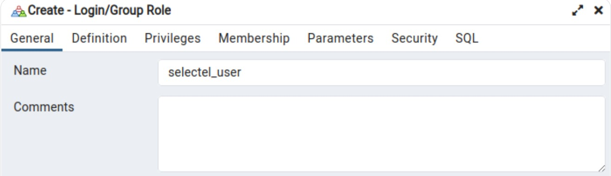

# Лабораторная работа. Представления
## Использование представлений в СУБД PostgreSQL.

>**Цель**: Получить теоретические и практические навыки создания представлений данных в СУБД PostgreSQL.

### Содержание лабораторной работы:
1.	Изучить теоретические сведения лабораторной работы.
2.	Создать любое простое представление и запросить с помощью него данные.
3.	Проверить соответствие данных прямым запросом.
4.	Изменить созданное представление с помощью команды ALTER VIEW, добавив
псевдонимы полям.
5. Изменить запрос созданного представления с помощью команды CREATE OR REPLACE VIEW.
6.	Вставить данные с помощью представления.
7.	Создать представление с опцией WITH CHECK OPTION.
8.	Удалить представление.
9.	Создать представление на выборку из двух таблиц с помощью редактора.
10. Создать роль Test_creator без права входа в систему, но с правом создания БД и ролей.
11. Создать пользователя user1 с правом входа в систему. Убедиться, что user1 не может создать БД.
12. Включить пользователя user1 в группу Test_creator.
13. Создать БД под пользователем user1.
14. Создать роли без права создания таблицы и с правом создания таблицы, последовательно проверить работу ролей.
15. Добавить к роли право на любые действия с таблицей, проверить работу прав.
16. Удалить право вставки в таблицу, проверить работу прав.
17.	Защитить лабораторную работу. - Любой вопрос по выполнению лабораторной работы; - Любой контрольный вопрос

### Краткий вспомогательный материал
**Представление (англ. view)** - хранимый в базе данных под отдельным именем запрос на выборку, по сути - это виртуальная таблица. Рассмотрим варианты использования 
представлений.  
- Возврат небольшого поднабора данных таблицы.  
- Предоставление пользователю возможности запроса данных из множества таблиц через одно представление, с точки зрения пользователя обращение будет происходить 
как к обычной таблице.  
- Модификация данных с помощью представлений.  
- Представления могут использоваться как механизмы безопасности, давая возможность пользователям обращаться к данным через представления, но не предоставляя 
им разрешений на непосредственный доступ к таблицам, лежащим в основе представлений.

Рассмотрим упрощенный формат создания представления:
``` SQL
CREATE VIEW <название> [(<список столбцов>)] AS <запрос> [WITH CHECK OPTION]
```
Здесь *< название >* − название представления, *<список столбцов>* − список названий столбцов, *< запрос >* − запрос, на котором основано представление.
WITH CHECK OPTION может указываться для обновляемых (updatable) представлений, через которые можно добавлять или изменять данные.

Для изменения различных дополнительных свойств представления используется оператор ***ALTER***:
``` SQL
ALTER VIEW [ IF EXISTS ] имя ALTER [ COLUMN ] имя_колонки SET DEFAULT выражение
ALTER VIEW [ IF EXISTS ] имя ALTER [ COLUMN ] имя_колонки DROP DEFAULT
ALTER VIEW [ IF EXISTS ] имя OWNER TO новый_владелец
ALTER VIEW [ IF EXISTS ] имя RENAME TO новое_имя
```
Для изменения запроса, определяющего представление, используйте команду CREATE OR REPLACE VIEW.

Удаление представления выполняется с помощью команды ***DROP***:
``` SQL
DROP VIEW <название>
```

**Пример:**
```SQl
--создаем представление
CREATE VIEW vAUTHORS (FIO) AS
SELECT DISTINCT Author FROM BOOKS

--изменяем имя столбца в представлении
ALTER TABLE vAUTHORS RENAME COLUMN FIO to AuthFIO;

--изменяем запрос представления
CREATE OR REPLACE VIEW vAUTHORS (AuthFIO) AS 
SELECT DISTINCT Author FROM BOOKS WHERE Publisher='BHV';

-- удаляем представление
DROP VIEW vAUTHORS
```

В приведенном примере название столбца в представлении будет отличаться от результата выражения *SELECT*. В следующем примере названия меняться не будут.

Создадим еще одно представление и попробуем c его помощью вставить запись.

***Пример:***
```SQL
--создаем представление
CREATE VIEW vBOOKS AS SELECT Bookname, Author, Publisher FROM BOOKS
WHERE Publisher =’BHV’
--вставляем запись
INSERT INTO vBOOKS VALUES (‘Война и мир’,’Л. Толстой’,’BHV’)
--вставляем запись с издательством, отсутствующем в представлении
INSERT INTO vBOOKS VALUES (‘Война и мир’,’Л. Толстой’,’Эксмо’)
```

SQL успешно выполнит оба запроса, т.е. через представление можно внести запись, которая не соответствует условию представления. Чтобы этого не происходило, изменим представление, добавив в него проверку.

```SQL
ALTER VIEW vBOOKS SET (check_option='cascaded');
```

Если представление предполагается использовать для модификации данных, вам следует помнить следующее:
- Если вы применяете представление для модификации данных, то эта модификация может повлиять только на базовую таблицу. Это означает, что если представление
отображает данные из двух таблиц, вы можете написать инструкцию, обновляющую только одну таблицу. Если же некоторая инструкция попытается обновить обе таблицы,
вы получите сообщение об ошибке.
- Вы не можете модифицировать данные в представлении, использующем агрегатные функции (например, SUM() или AVG()). Если вы попытаетесь модифицировать такое
представление, то получите сообщение об ошибке.
-При попытке вставить запись в представление, не отображающее все поля, может возникнуть проблема. Некоторые из полей, не отображаемые в представлении, могут
не принимать пустые значения, вы не можете вставить данные в поля, отсутствующие в представлении.

### Запросы DCL 

**Data Control Language (DCL)** – группа операторов определения доступа к данным. Иными словами, это операторы для управления разрешениями, с помощью них мы можем разрешать или запрещать выполнение определенных операций над объектами базы данных.

Сюда входят:

* GRANT – предоставляет пользователю или группе разрешения на определённые операции с объектом;
* REVOKE – отзывает выданные разрешения.


### Создание пользователя PostgreSQL

 В современных версиях этой СУБД нет понятий «пользователь» или «группа», они объединены в одну сущность — «роль». И хотя в Postgres есть отдельные команды для создания пользователя или роли, на самом деле они создают одну и ту же сущность. Роль может иметь возможность входа в систему (то есть подключаться к БД и выполнять запросы) или не иметь ее.

Для удобства во многих ​​руководствах и инструментах роль с возможностью входа называется «пользователь», а роль без этой возможности — «группа» или «групповая роль». В этой статье мы тоже будем придерживаться этих наименований.

Итак, существует несколько способов создания пользователя в командной строке:
1. **CREATE ROLE** — SQL-команда, которая выполняется на сервере базы данных. По умолчанию создается роль с параметром NOLOGIN, который означает, что эта роль не может залогиниться в СУБД. Но если указать явно параметр LOGIN, тогда эта команда будет эквивалентна созданию пользователя.

Синтаксис:
```sql
CREATE ROLE <название> 
```

Пример использования:
CREATE ROLE selectel_user LOGIN PASSWORD ‘bestpass’; — создать пользователя и установить ему пароль.

2. **CREATE USER** — тоже SQL-команда, которая выполняется на сервере. Это алиас к предыдущей команде CREATE ROLE. Единственно отличие в том, что эта команда по умолчанию использует параметр LOGIN, который разрешает логиниться в базу данных.

Синтаксис и пример использования аналогичны команде CREATE ROLE.

### Создание пользователя PostgreSQL в графическом интерфейсе

С помощью pgAdmin подключимся к базе данных и в разделе Login/Group Roles вызовем контекстное меню и выберем Create — Login/Group Role.


Появится диалоговое окно с несколькими вкладками. На первой вкладке укажем имя пользователя, при желании можно указать его описание в поле Comments:



На вкладке Definition зададим пароль. Тут же можно указать дату истечения, после которого пользователю обязательно нужно будет сменить пароль:


На вкладке Privileges можно указать, какими полномочиями будет обладать пользователь: логиниться, создавать другие роли или базы данных, будет ли это суперпользователь и т.п. Мы выберем лишь опцию Login, остальное оставим по умолчанию:


На вкладке Membership можно присвоить пользователю роли. Для примера мы присвоим ему встроенную в Postgres роль pg_monitor, которая дает права на просмотр различных таблиц и представлений, связанных с мониторингом и диагностикой базы данных:


На последней вкладке SQL можно увидеть SQL-команды, с помощью которых будет создан пользователь. Запоминать и копировать их не обязательно, pgAdmin выполнит их за нас. Эта вкладка нужна скорее для финальной проверки.


Нажимаем на кнопку Save, и пользователь создается. Мы можем увидеть его в разделе Login/Group Roles:


### Добавление и удаление прав с помощью групп

В Postgres роли могут наследоваться от других ролей. А так как роль — это либо «пользователь», либо «группа», получается, что пользователи могут наследовать привилегии от групп или других пользователей. Мы рассмотрим настройку с наследованием от групп. Создадим две группы: одну с правами только на чтение данных из таблицы, а другую — с правами на чтение и запись. По очереди назначим пользователю эти группы и посмотрим на результат.

Создаем группы:

```sql
CREATE ROLE "read_only_role";
CREATE ROLE "read_write_role";
```

Мы создали группы, но не дали им никаких привилегий. В нашей БД есть таблица person, на которой мы будем проверять работу назначения привилегий. Группе read_only_role дадим права на чтение этой таблицы, а группе read_write_role — на чтение и запись:
sql
```sql
GRANT SELECT ON TABLE person TO read_only_role;
GRANT SELECT, INSERT, UPDATE, DELETE on TABLE person TO read_write_role;
```

Группы созданы, но наш пользователь еще не унаследовал их привилегии. Для начала убедимся, что у него нет прав на чтение данных из таблицы. Залогинимся в БД под пользователем selectel_user и выполним команду:

```sql
SELECT * FROM person;
```

Получим ошибку: 

```
ERROR:  permission denied for table person
```

Теперь из под учетной записи владельца присвоим пользователю роль на чтение:

```sql
GRANT read_only_role TO selectel_user;
```

Снова попробуем выполнить запрос от имени пользователя и увидим результат:


Теперь попробуем вставить строку в таблицу:

```sql
INSERT INTO person VALUES (101, 'fj48h39ru399', 'Anna', 'Ivanova', 'Female', 'test@mail.ru', '89007250000', '2000-01-01 00:00:00', 'Student');
```

Получим ошибку:

```
ERROR:  permission denied for table person
```

Все работает,  как мы планировали: у пользователя есть права на чтение данных из таблицы, но нет прав на вставку данных (а также изменение и удаление, но мы не будем это проверять).

Теперь заберем у пользователя группу на чтение и присвоим группу с правами на чтение и запись:

```sql
REVOKE read_only_role FROM selectel_user;
GRANT read_write_role TO selectel_user;
```

Снова попробуем вставить строку и убедимся, что данные появились в таблице. Результат выполнения команды:
```sql
INSERT 0 1
```

### Изменение пользователя: добавление привилегий напрямую и смена пароля

Добавим пользователю привилегии на таблицу person напрямую. Это делается аналогично назначению привилегий на группу, только вместо группы укажем имя пользователя. В этот раз вместо указания конкретных привилегий мы воспользуемся конструкцией ALL PRIVILEGES, которая сразу дает все полномочия на таблицу:

```sql
GRANT ALL PRIVILEGES ON TABLE person TO selectel_user;
```
Итак, мы назначили пользователю привилегии на таблицу напрямую, минуя роли.

Также покажем, как можно обновить пароль пользователю. Для этого достаточно выполнить одну простую команду:

```sql
ALTER USER selectel_user PASSWORD 'newpass';
```

## Контрольные вопросы
1.	Что такое представление? Когда оно используется?
2.	Опишите формат создания представления.
3.	Каковы возможности по работе с представлениями?
4.	Опишите опцию WITH CHECK OPTION.
5.	С помощью какой команды можно удалить представление?
6.	С помощью какой команды можно изменить представление?
7.	Какие вы знаете ограничения на модификацию данных через представление?
8. Что такое DCL? Какие операторы туда вхолдят?
9. В чем заключается отличие пользователя от роли в PostgreSQL? 
10. Перечислите способы создания пользователя.
11. Опишите структуру команды GRANT. 
12. Опишите структуру команды REVOKE.
13. С помощью какой команды можно сменить пароль пользователя?
