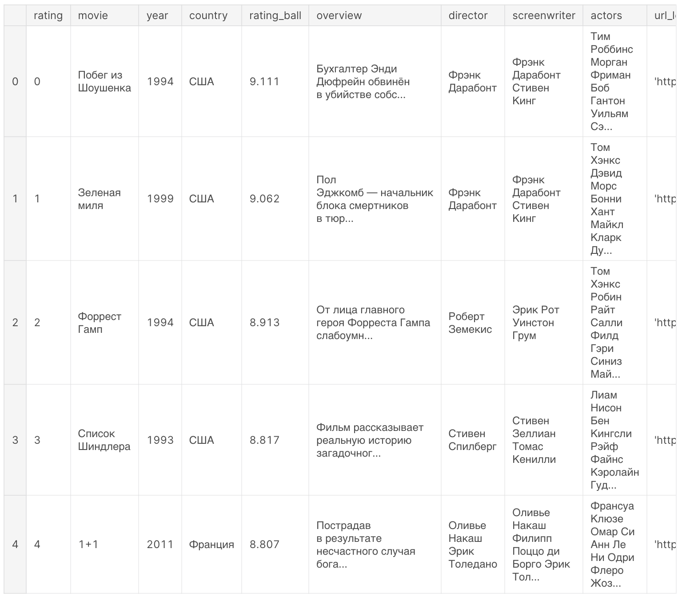

# Курсовая работа

## Цель работы

Закрепление теоретических знаний, полученных в ходе
лекций, приобретения навыков проектирования баз данных, накопление опыта работы с
СУБД «PostgreSQL» а также опыта создания десктопных приложений на выбранном языке прогрпммирования.

## Подготовка

Для выполнения курсовой работы необходимо скачать датасет по варианту.
Варианты опеределяются по списку группы следующим образом:
+ 1 вариант по списку берет 1 датсет
+ 2 вариант по списку берет 2 датсет
+ 3 вариант по списку берет 3 датсет
+ ...
+ 10 вариант по списку берет 1 датсет
+ 11 вариант по списку берет 2 датсет
+ 12 вариант по списку берет 3 датсет

и т.д.

## Список датасетов
1. [Kinopoisk-TOP250]('https://www.kaggle.com/datasets/alexandertesemnikov/kinopoisktop250russiandataset')
2. [IMDB Movies Dataset](https://www.kaggle.com/datasets/harshitshankhdhar/imdb-dataset-of-top-1000-movies-and-tv-shows)
3. [Netflix Movies and TV Shows](https://www.kaggle.com/datasets/shivamb/netflix-shows)

## Общее задание

Обычно, датасет представляет из себя одну большую таблицу с множеством атрибутов. 

 

Так как атрибутов много и все они объединены, следующим шагом необходимо разбить эту таблицу на несколлько отдельных таблиц по сущностям и [нормализовать отношения](https://habr.com/ru/post/129195/) между ними.

После этого уже можно создавать таблицы и строить отношения между ними непосредственно в самой БД.

> :bulb: По необходимости можно поменять типы атрибутов, но только если они не изменяюь общую логику, например:
в датасете ID задан как varchar, а вы хотите поменять его на int.

## Задания по вариантам

