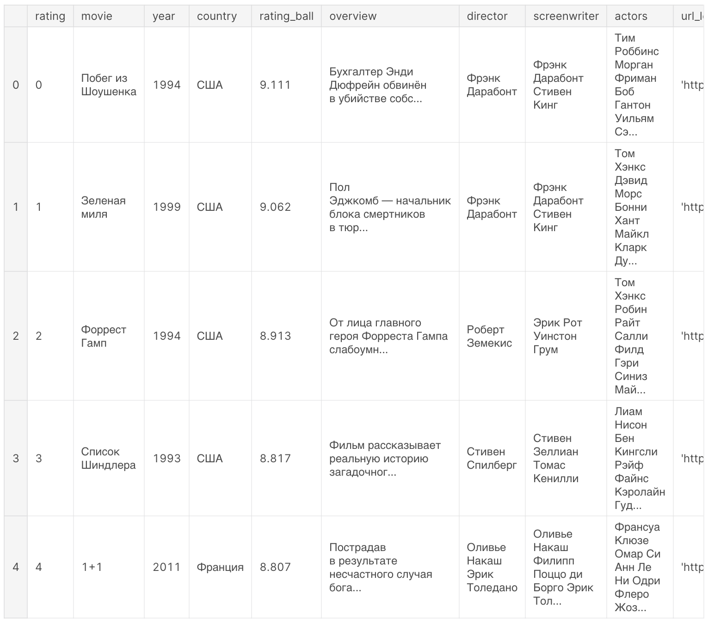

# Курсовая работа

## Общее задание

Для выполнения курсовой работы необходимо выбрать датасет. Едиственное, стоит учесть, что не все датасеты одинаково хорошо подойдут под данную работу.

Обычно, датасет представляет из себя одну большую таблицу с множеством атрибутов. Так как атрибутов много и все они объдинены, следующим шагом необходимо нормализовать отношения.

После нормализации отношений - строятся таблицы и задаются связи уже непосредственно в базе данных.

## Задания по вариантам

## Пример
Для примера возьмем датасет - [Kinopoisk-TOP250]('https://www.kaggle.com/datasets/alexandertesemnikov/kinopoisktop250russiandataset')

  

1. Нормализация

