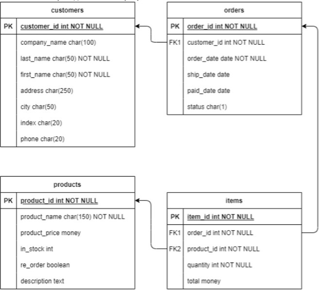
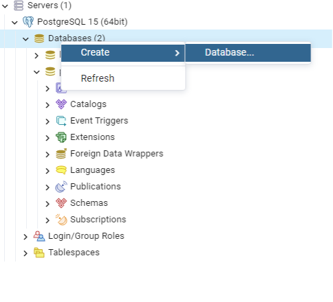

# Лабораторная работа №1-2
## Создание базы данных в СУБД PostgreSQL. Основы программирования на языке SQL: Добавление, Изменение и Удаление дынных.

>**Цель**: Получить теоретические и практические навыки создания базы данных в СУБД PostgreSQL, изучить основные понятия и операторы, научиться работать с базами данных из скрипта питон, сформировать знания и умения по программирования на языке SQL, приобрести практические навыки работы со средствами языка SQL для обновления, удаления и вставки данных в БД 

### Содержание лабораторной работы:
1.	Изучить теоретические сведения лабораторной работы.
2.	Создать таблицы (две с помощью запроса и две с помощью графического способа).
3.	Создать ограничение на уникальность по двум столбцам (имя + фамилия)
4.	Создать ограничение на проверку данных.
5.	Создать значение по умолчанию.
6.	Заполнить каждую таблицу базы данных (минимум 7 записей в каждую таблицу) с помощью команды INSERT. ПРИМЕЧАНИЕ: для просмотра содержания таблиц необходимо использовать запрос SELECT * FROM <название таблицы>
7.	Изучить команду для обновления данных в таблицах.
8.	Изучить команду для удаления данных из таблиц.
9.	Создать SQL-скрипт БД.
10.	Защитить лабораторную работу. - Любой вопрос по выполнению лабораторной работы; - Любой контрольный вопрос

### Таблицы для примеров 

  

Чтобы не возникало лишних вопросов, стоит сразу прояснить, что методические указания показывают лишь пример взаимодействия с базами данных на основе таблиц, которые приведены ниже.  Гораздо лучше для понимания будет работа на основе собственных баз данных.  
  

Краткий вспомогательный материал лабораторной работы
PostgreSQL является объектно-реляционной СУБД, т.е. объединяет реляционную модель с принципами объектно-ориентированного подхода.
В методических указаниях используется PostgreSQL версии 15.  
  
  
Физическое размещение файлов баз данных в PostgreSQL
В PostgreSQL область, где хранятся файлы баз данных называется кластер. В файловой системе кластер хранится как каталог, содержащий все данные. Список баз данных подгружается из этого каталога при запуске сервера.  
Расположение кластера задается при установке самой PostgreSql на ваш ПК. 
Подробнее про физическое размещение баз можно прочитать [здесь]( https://postgrespro.ru/docs/postgresql/14/storage).    
### Компоненты СУБД PostgreSQL
**Tables (Таблицы).** Таблицы базы данных предназначены для хранения данных. Таблица состоит из строк и столбцов. Число столбцов и их порядок фиксированы, для каждого столбца определено имя и тип данных. Число строк переменно и отражает текущее количество данных, находящихся в таблице.  
**Views (Представления).** По сути своей являются «виртуальными таблицами». Представление - это поименованный запрос SELECT.  
**Indexes (Индексы).** Существуют для поддержания вместе с данными информации об их упорядоченности по различным критериям, что позволяет существенно повысить производительность некоторых операций, в частности поиска данных. Индексы существуют непосредственно вместе с таблицами и не имеют смысла сами по себе. Индексирование может быть выполнено по одному или нескольким столбцам и произведено в любой момент.  
**Keys (Ключи).** Подобно индексам, ключи не существуют сами по себе. Ключ - один из типов ограничений целостности.  
**Defaults (Умолчания).** Не существуют отдельно от таблиц. Умолчания определяют, какие значения будут подставлены в поле данных при добавлении строки, если значение не задано явно.
Rules (Правила). Механизм, предназначенный для установления ограничений на диапазон возможных значений поля таблицы или нового типа данных, определяемого пользователем.  
**Constraints (Ограничения целостности).** Определяют диапазон возможных значений полей таблицы.  
**Stored Procedures (Хранимые процедуры).** Поименованный набор команд SQL. Хранимые процедуры располагаются на сервере вместе с базой данных и могут запускаться различными пользователями, имеющими соответствующие права.  
**Triggers (Триггеры).** Не существуют отдельно от таблицы. Триггер - специальный вид хранимой процедуры. Триггер может выполняться при изменениях данных или событиях в базе данных.  
**User-defined data types, UDDT (Определяемые пользователем типы данных).** Предоставляет специальный аппарат для создания пользовательских типов данных.  
**User-defined functions, UDF (Определяемые пользователем функции).** Представляет собой набор команд SQL, сохраненных в специальном виде.  
**Users (Пользователи).** Определяет список пользователей базы данных. Служит для работы механизма защиты данных.  
**Roles (Роли).** Роли пользователей - важный механизм для организации разграничения доступа. Пользователю может быть назначена одна или больше ролей.  
### Подготовка для работы.
Итак, теперь, когда Вы готовы постигать тонкое искусство работы с базами данных необходимо подготовить все для работы.  
Начнем с того, что саму PostgreSql необходимо установить на Ваш ПК, в этом Вам помогут любые туториалы на ютубе, если они вообще понадобятся.  
Лично я устанавливал Postgre с [данного сайта](https://www.postgresql.org/ftp/pgadmin/pgadmin4/v6.15/windows/).  
### Альтернативные способ установки PostgreSQL:
Если не хотите устанавливать СУБД нативно, есть ещё несколько вариантов:  
1)	Виртуальная машина, подойдёт любая:
+ Open-source решения:  
    + [VirtualBox](https://www.virtualbox.org/) 
    + [Qemu](https://www.qemu.org/)
+ Проприетарные:  
    + VM Ware Workstation (есть бесплатная версия)
    + Parallels (MacOS)
2)	Если у вас Windows – [Windows Subsystem for Linux](https://learn.microsoft.com/ru-ru/windows/wsl/install)
3)	[Docker](https://www.docker.com/)

Если Вы выбираете первые два альтернативных способа установки, то рекомендуется в качестве хостовой ОС устанавливать [Ubuntu Server](https://ubuntu.com/download/server) и уже на него, соответственно, ставить Postgres.

### Взаимодействие с БД:
Для работы с БД надо будет установить средства администрирования
Список рекомендаций:  
+ **[pgAdmin](https://www.pgadmin.org/)** – можно устанавливать как нативно, так и на виртуальную машину / в контейнере рядом с бд – open-source
+ **[DBeaver](https://dbeaver.io/)** - open-source
+ **[DataGrip](https://www.jetbrains.com/ru-ru/datagrip/)** – можно получить студенческую лицензию по бауманской почте (возможно сейчас не работает, надо проверить)

### Создание базы данных в графическом интерфейсе pgAdmin.
По пункту **databases** нажимаем правой кнопкой мыши  
Далее вводим имя таблицы и нажимаем на кнопку **Save**. Ура, у нас создана наша первая бд! Теперь мы будем использовать графический интерфейс в основном для проверки выполнения заданий.



### Работа с БД с помощью языков программирования:
> **Примечание: запрещается использовать ORM и разные builder’ы – только чистый SQL.**

После процесса установки самой бд перейдем в среду разработки PyCharm (любую другую IDE) и установим в ней библиотеку **psycopg2**. Она позволит нам взаимодействовать с бд из скрипта питон.
Установить данную библиотеку можно с помощью команды: 
``` Python
pip install -U psycopg2-binary 
```
Теперь остался последний шаг, установка **pgAdmin**. Фактически это – графический интерфес для работы с бд Postgre (Аналог Microsoft Sql Server, только для Postgre).  

Теперь, когда все установлено можем приступать к работе.
Итак, как и было сказано ранее, вся работа с нашей бд будет проводиться с использование библиотеки **psycopg2**.
Давайте посмотрим на кусок кода ниже и разберемся, что же в нем происходит.
``` Python
import psycopg2
host = "localhost"
user = 'admin'
password = 'admin'
db_name = 'lab'

try:
    connection = psycopg2.connect(
        host = host,
        user = user,
        password = password,
        database = db_name,
    )
    connection.autocommit = True

    #connect to db
    with connection.cursor() as cursor:
#         cursor.execute(
#             """CREATE TABLE IF NOT EXISTS customers(
#             customer_id int PRIMARY KEY NOT NULL,
#             company_name char(100),
#             last_name char(50) NOT NULL,
#             first_name char(50) NOT NULL,
#             adress char(250),
#             city char(250),
#             index char(20),
#             phone char(20)
#            );"""
#         )

        cursor.execute(
            """CREATE TABLE IF NOT EXISTS orders(
            order_id int PRIMARY KEY NOT NULL,
            customer_id int REFERENCES customers(customer_id),
            order_date date NOT NULL,
            ship_date date,
            paid_date date,
            status char(1)
            );"""
        )

except Exception as ex:
    print(ex)
```
Для начала мы создаем переменные:  
**host** – т.е. куда необходимо отправлять запросы, чтобы получить доступ к нашей бд  
**user** – имя пользователя. Оно необходимо, чтобы мы могли «залогиниться» в нашей бд 
**password** – тут думаю ничего не надо объяснять 
**db_name** – имя бд с которой мы хотим работать.  
Далее мы подключаемся к нашей бд с помощью команды 
``` Python
connection = psycopg2.connect()
```
В качестве параметров мы как раз и передаем те самые 4 переменные.
В postgre есть небольшая особенность, заключается она в том, что для того, чтобы изменения сохранялись их необходимо коммитить. И либо нужно прописывать коммит каждый раз после запроса, либо можно поставить
``` Python
connection.autocommit = True
```
чтобы не прописывать каждый раз коммит руками.
``` Python
with connection.cursor() as cursor:
        cursor.execute()
```
Эти две строчки отвечают за передачу нашего запроса в бд PostgreSql.
А в функции cursor.execute мы и прописываем нужные нам запросы и команды.

### Создание таблицы через скрипт  
Создадим в базе данных 4 таблицы. Первая таблица, **customers**, будет хранить такую информацию о клиентах как название фирмы, фамилия, имя, адрес, город, индекс, телефон. Вторая таблица, **orders**, будет содержать подробную информацию о заказах
— номер заказа, идентификатор покупателя, даты отправки и оплаты, а также статус заказа ('С' - Cancelled отменен, 'P' - Processed обработан), идентификатор продукта и заказанное количество. Третья таблица, **products**, будет хранить такую информацию о продукте, как название, цена продукта, его количество на складе, необходимость перезаказа и описание. Таблица **items** содержит идентификатор заказа, идентификатор продукта в заказе и его количество, общую сумму по данной позиции.  
Таблицы создаются командой
``` SQL
CREATE TABLE [IF NOT EXISTS] table_name (
column_1 datatype [column_constraint], column_2 datatype [column_constraint], column_3 datatype [column_constraint],
...
);
```
Здесь:   
**table_name** - имя таблицы;  
**column_x** - имя столбца в таблице;  
**datatype** - тип данных для столбца;  
**column_constraint** – имя ограничения столбца (необязательно).  

**Пример:** Создать таблицу orders, содержащую поля: id, customer_id, order_date, ship_date, paid_date, status.
``` SQL
CREATE TABLE IF NOT EXISTS orders(
order_id int PRIMARY KEY NOT NULL,
customer_id int REFERENCES customers(customer_id), order_date date NOT NULL,
ship_date date, paid_date date, status char(1)
);
```
Чтобы команда сработала помещаем ее в описанный ранее cursor.execute и получаем:
``` Python
cursor.Execute(
    """CREATE TABLE IF NOT EXISTS orders(
order_id int PRIMARY KEY NOT NULL,
customer_id int REFERENCES customers(customer_id), order_date date NOT NULL,
ship_date date, paid_date date, status char(1)
);"""
)
```

Вуаля таблица создана. Аналогичным образом создайте еще 3 таблицы.  
+ Для того, чтобы для поля order_id применялось автоинкрементирование, нужно указать тип данных serial
+ Ограничение NOT NULL указывает, что ячейке столбца нельзя присваивать значение NULL.
+ Для столбца order_id определено ограничение в виде первичного ключа (PRIMARY KEY).  

Ограничение **REFERENCES** указывает на то, что столбец является внешним ключом для таблицы customers. В скобках указан столбец, являющийся первичным ключом в этой таблице. Если в БД отсутствует таблица, на которую ссылается внешний ключ, запрос не выполнится. Поэтому сначала создайте таблицу сustomers, используя этот пример.
Другой вариант – не задавать для столбца customer_id ограничение внешнего ключа, а добавить его после создания таблицы с помощью команды ALTER TABLE.  

**ALTER TABLE** – команда для изменения определения существующий таблицы. С ее помощью можно добавлять, удалять и изменять столбцы таблицы, добавлять ограничения и многое другое. Подробнее [здесь](https://postgrespro.ru/docs/postgresql/14/sql-altertable).  
Пример команды для добавления ограничения внешнего ключа, если оно не было указано при создании таблицы:  
**IF NOT EXIST** позволяет перед создание таблицы проверить, что таблицы с таким название не существует, это помогает избежать лишних ошибок.  

### Использование значений по умолчанию (задание лабораторной работы)
Установка для полей значений по умолчанию — это отличный способ избавить пользователя от излишней работы, если значения этих полей во всех записях, как правило, принимают одни и те же значения.
Так в таблице заказов orders вполне логично определить по умолчанию значение поля order_date в виде текущей даты. В этом случае при добавлении записи о новом заказе в случае пропуска этого поля оно будет автоматически заполняться значением системной даты.
 
+ Значение по умолчанию можно задать графически через *Modify Table*. Там будет поле *Default*. Ввести нужно *current_date*
+ Или скрипт:
    ``` SQL
    order_date date not null default current_date
    ```

### Использование операторов INSERT, UPDATE, DELETE
В SQL заполнение таблиц производится при помощи следующей команды:
``` SQL
INSERT INTO <имя таблицы>(<список столбцов>) VALUES (<список значений>);
```
где *<имя_таблицы>* - таблица, куда вставляются данные, <списокстолбцов> - список полей, в которые вставляются данные (если он не указывается, то подразумевается заполнение всех полей). В списке полей поля указываются через запятую,
*<список_значений>* - значение полей для вставки через запятую

**Пример:** Добавление записи в таблицу **Orders**
 ``` SQL
 INSERT INTO Orders (order_id, customer_id, ship_date, status)    VALUES (1, 1, '12/02/2022', 'S');
 ```

Из таблицы можно удалить все столбцы, либо отдельные записи. Это осуществляется командой:  
``` SQL
DELETE FROM <Имя таблицы> [WHERE <Условие>]
```

**Пример:** Удалить записи из таблицы **Orders**, у которых поле *customer_id = 10*.
``` SQL
DELETE FROM Orders WHERE customer_id = 10;
```
где *<Условие>* - условие, которым удовлетворяют удаляемые записи, если условие не указано, то удаляются все столбцы таблицы.  

Также существует команда **TRUNCATE** для быстрого удаления всех данных из таблицы.
``` SQL
TRUNCATE <Имя таблицы>
```

Значение полей таблицы можно обновить (изменить), используя следующую команду:
``` SQL
UPDATE <Имя таблицы> SET
    <Имя поля1> = <Выражение1>,
    [<Имя поля2> = <Выражение2>, ... ]
    [WHERE <Условие>]
```
Здесь *<Имя поля1>, <Имя поля2> …* - имена изменяемых полей;  
*<Выражение1>, <Выражение 2> …* - значения, которые должны принять поля;  
*<Условие>* - условие, которым должны соответствовать записи, поля которых изменяем. В качестве выражения можно использовать математические формулы.  
**Пример:** для таблицы orders установить сегодняшнюю дату отправки для всех обработанных заказов
``` SQL
UPDATE orders SET ship_date = CURRENT_DATE WHERE status='Р';
```

Для того, чтобы вывести, например, все записи таблицы пропишем Select запрос:
``` SQL 
SELECT * FROM orders;
```
Чтобы вывести в консоль (мы же программисты все же) полученные данные, добавим еще одну строчку и получим:
``` Python
cursor.execute(
    """SELECT * FROM orders;"""
)
print( cursor.fetchone())
```
Собственно **print( cursor.fetchone())** и отвечает за выдачу данных к нам на экран.

## Контрольные вопросы
1.	Что такое СУБД?
2.	В чем основное отличие объектно-реляционной СУБД?
3.	Назовите компоненты основных типов объектов БД. Какие функции они выполняют?   
4.	В чем заключается отличие таблиц от представлений?
5.	Какие типы данных используются в PostgreSQL?
6.	Опишите структуру запроса для создания таблицы.
7.	Что такое первичный ключ? Почему первичный ключ должен быть уникальным?
8.	Как реализуется связь между таблицами? Объяснить на примере запроса создания связи между таблицами с помощью внешних ключей.
9.	Для чего нужна команда ALTER TABLE?
10.	Для чего используются проверочные ограничения? Как создать ограничение на проверку?
11.	Зачем используются значения по умолчанию? Как установить значение по умолчанию?
12.	Опишите структуру команды INSERT для заполнения таблицы.
13.	Опишите структуру команды DELETE для удаления записей из таблицы.
14.	Опишите структуру команды UPDATE для записей из таблицы.
15.	Для чего нужна команда TRUNCATE
